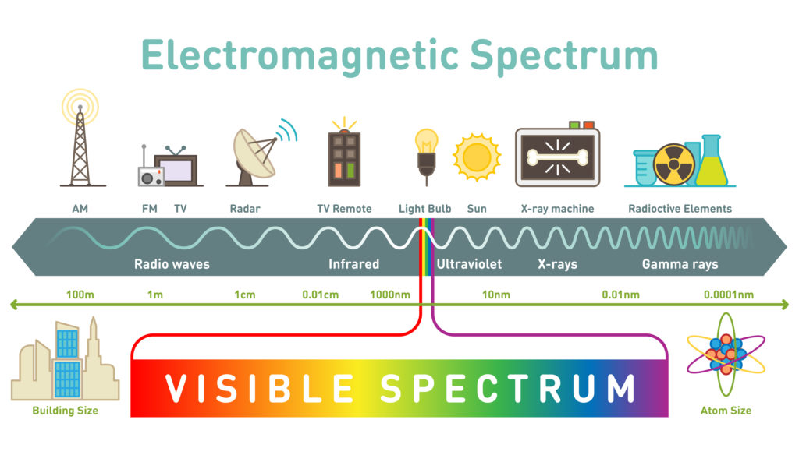
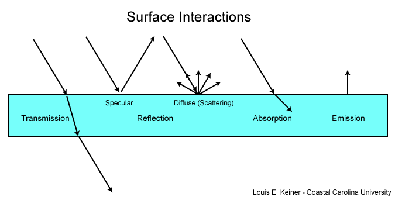
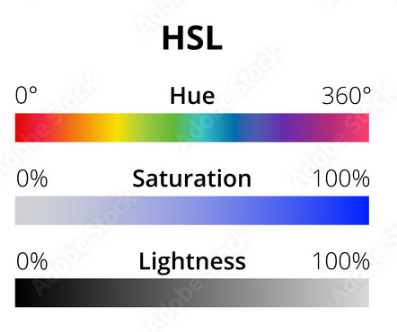

## The Light Spectrum

**What is Light?**

- At its core, light is a form of electromagnetic radiation that's visible to the human eye. It plays an essential role in our ability to see the world around us.

**How Does Light Travel?**

- Light moves as a wave, traveling in straight lines called rays. These rays bounce off objects and enter our eyes, which is how we perceive our surroundings.
- The speed of light is approximately 299,792,458 meters per second in a vacuum, making it the fastest thing in the universe.

**The Spectrum of Light:**

- The light spectrum consists of a range of colors, often visualized as a rainbow. It spans from violet, with the shortest wavelengths, to red, with the longest.
- Beyond the visible spectrum, there are forms of light humans can't see, such as ultraviolet (UV) and infrared (IR) light.

**Wavelengths and Colors:**

- Light's color depends on its wavelength. Shorter wavelengths appear blue or violet, while longer ones look red or orange.
- White light, like sunlight, is a combination of all colors. When passed through a prism, it disperses into its individual colors, creating a spectrum.

**Luminosity and Perception:**

- Different colors have varying degrees of luminosity. For humans, yellow-green light seems the brightest due to the sensitivity of our eyes at those wavelengths.
- Objects appear colored based on the wavelengths they reflect. A red apple, for instance, absorbs all colors except red, which it reflects to our eyes.
## How Do We Perceive Light?

We perceive light through a complex process involving both our eyes and our brain.

1. **Emission or Reflection**: First, light is either emitted by a source (like the sun, a light bulb, or a screen) or reflected off objects.

2. **Transmission**: This light travels through a medium, which is usually air, but could be a vacuum, water, or glass, among others.

3. **Interaction with the Eye**: When this light reaches our eyes, it enters through the cornea, which bends the light. It then passes through the pupil, the size of which is controlled by the iris to allow more or less light in.

4. **Refraction**: The light is further refracted by the lens behind the iris, which adjusts its shape to focus the light onto the retina at the back of the eye.

5. **Conversion to Electrical Signals**: The retina contains photoreceptor cells called rods and cones. Rods are sensitive to light intensity and are used primarily for black-and-white vision in low light. Cones are sensitive to color and require brighter light to function. When light hits these photoreceptor cells, it triggers a chemical reaction that converts the light into electrical signals.

6. **Transmission to the Brain**: The optic nerve carries these electrical signals from the retina to the visual cortex in the brain.

7. **Image Processing**: The brain then processes these signals to create the images we see, flipping them the right way up (as the lens of the eye actually projects an upside-down image onto the retina) and combining the images from each eye to produce a three-dimensional view with depth perception.

## Light Interaction with Matter

When light encounters matter, several things can happen:

**Transmission:**

This refers to light passing through a material. The degree to which light is transmitted depends on the material's transparency. For instance, clear glass or water allows a significant amount of light to pass through, while opaque materials do not.

**Reflection:**

Reflection occurs when light bounces back after hitting a surface. This can be further categorized into:

- **Specular Reflection:** This is the reflection of light from a smooth, shiny surface where the light reflects at a single angle. Mirrors and polished metals typically exhibit this type of reflection.

- **Diffuse (Scattering) Reflection:** This happens when light reflects off a rough surface and scatters in many different directions. An example is how sunlight scatters in all directions after striking a rough surface like a wall or the ground.

**Absorption:**

When light strikes a surface and doesn't reflect or transmit, it gets absorbed. The absorbed energy often gets transformed into heat. The color we see on an object is usually the color that is not absorbed. For instance, a red apple absorbs all colors except red.

**Emission:** 

Emission refers to the production and release of light by a source. The sun, light bulbs, and fireflies are all examples of sources that emit light. The emitted light can then undergo other interactions like reflection, transmission, or absorption when it encounters other materials.

**The Importance of Light in Technology:**

- Light's properties are harnessed in various technologies, from fiber optics, which use light to transmit data over long distances, to lasers used in medical and industrial applications.
## Hue, Saturation and Luminance

The concepts of hue, saturation, and luminance (or brightness) are central to our understanding of color in both the artistic and scientific communities. They are the three primary characteristics that describe the properties of color that we perceive:

### Hue

Hue is what we most commonly think of as 'color.' It's the aspect that distinguishes red from blue, orange from yellow, and so on. It corresponds to the dominant wavelength of light when considering color scientifically. In the visible spectrum, hues correspond to light wavelengths that range from deep reds (longer wavelengths) to violets (shorter wavelengths).

On a color wheel, which is a common tool for artists and designers, hues are arranged in a circle, allowing one to see the relationships between the colors, such as primary (red, blue, yellow), secondary (green, orange, purple), and tertiary colors (blues-green, red-violet, etc.).
### Saturation

Saturation, sometimes referred to as chroma, measures the intensity or purity of a color. A highly saturated hue has a vivid, intense color, while a less saturated hue appears more muted or gray.

In technical terms, saturation is the degree to which a pure color is mixed with white or gray. Imagine adding black or white paint to a pure pigment; this process desaturates the color, making it less pure and reducing its intensity.

In digital media, decreasing the saturation of an image can gradually turn the image into grayscale.
### Luminance (or Brightness)

Luminance describes the perceived brightness or lightness of a color. A color with higher luminance appears brighter and more light-reflective. In contrast, a color with lower luminance is darker and absorbs more light.

This is particularly noticeable when you convert a colorful image to black and white: Areas that were light in color (high luminance) become white, while areas that were dark in color (low luminance) become black.

Luminance is not just the amount of light that comes from a source or object but also how much it appears to reflect or emit light in a given context.

Together, these three attributes allow us to describe any perceivable color. They also allow us to manipulate color in a variety of fields, from painting and printing to digital design and photography. Understanding how these three aspects interplay provides a comprehensive grasp of color manipulation and reproduction. For example, when calibrating a screen or printing, adjustments are often made to hue, saturation, and luminance to achieve accurate color representation.
## Color vs Chromaticity

Chromaticity and color are terms often used in the field of color science, and while they are related, they refer to different aspects of how we perceive color.
#### Color

Color is the characteristic of visual perception described through color categories, with names such as red, blue, yellow, green, etc. It is a comprehensive concept that includes three dimensions:

- **Hue**: The type of color we perceive, such as red, blue, or yellow, which is determined by the dominant wavelength of light.
- **Saturation**: The intensity or purity of the color, which defines how vibrant the color is or how much it is diluted by white light.
- **Brightness/Luminance**: The perceived intensity of the light. Brightness tells us how much light seems to be emitted by a color. In a technical context, luminance is the measurable aspect of how much light is emitted or reflected.
#### Chromaticity

Chromaticity is a specification of the quality of color regardless of its luminance. It tells us about the hue and saturation of the color but not about its brightness. Chromaticity is often represented on a two-dimensional plane, such as the CIE 1931 xy chromaticity diagram, where each point represents a unique hue and saturation but not brightness.

To summarize:

- **Color** encompasses hue, saturation, and brightness.
- **Chromaticity** describes hue and saturation without brightness.

## References

[Color for VFX v2.1.pdf (chrishealer.com)](http://www.chrishealer.com/materials/Color%20for%20VFX%20v2.1.pdf)