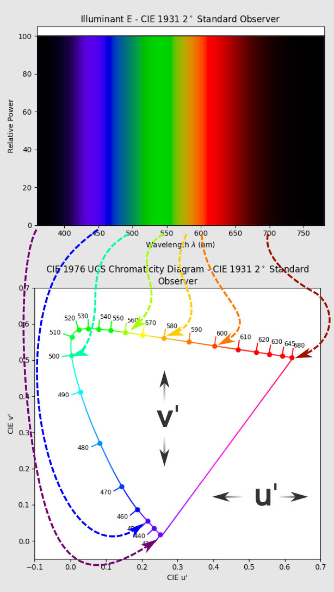
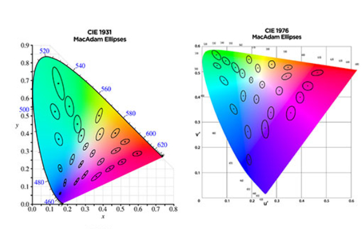

## The CIE

The **CIE**, or Commission Internationale de l'Éclairage, was established to create standards that would allow for the consistent representation and communication of color. It is foundational in understanding how we perceive color and in the development of technologies and applications that require precise color management.

The CIE was created to develop an international standard for color measurement that is based on the human perception of colors. Before the CIE, there was no unified way of describing colors in a way that would be consistent across different observers or lighting conditions.
## The LMS Color Space

Humans interact with light through specialized cells in the retina called photoreceptors. There are two types:

- **Rods:** These cells are sensitive to light intensity, contributing mainly to night vision.
- **Cones:** These are sensitive to color and come in three types, each responding to different wavelengths of light corresponding to the S (short), M (medium), and L (long) wavelengths of the visible spectrum.

The human retina contains three types of cones, commonly referred to as S (short), M (medium), and L (long) cones, each type being most sensitive to different parts of the visible light spectrum:

- **S (short) Cones:** These cones are most sensitive to light wavelengths that are perceived as blue, with peak sensitivity around 380-540 nm (nanometers). (biased towards 420 nm)
- **M (medium) Cones:** These cones are most sensitive to light that is perceived as green, with peak sensitivity around 440-670 nm. 
  (biased towards 530 nm)
- **L (long) Cones:** These cones are most sensitive to light perceived as red, with peak sensitivity around 500-700 nm. 
  (biased towards 560 nm)

The curves in the diagram represent the relative sensitivity of each type of cone across the visible spectrum. The peaks of each curve show where the sensitivity is highest for each cone type. 

In the LMS color space, representing the responses of the eye's cones, there is a significant overlap in the wavelengths. This overlap means that each type of cone doesn't just see one color; they see a range of colors. But they have peak sensitivity where they respond the most to light.

The reason why these curves are important is that they provide the foundational data for creating color matching functions, which are integral to the CIE color models.

## Tristimulus Color Values
### Problems with LMS
#### Individual Differences

The LMS color space is based directly on the responses of the human eye's cone cells to light of different wavelengths. LMS values are based on the average responses of the cones, but actual responses can vary significantly between individuals due to factors like varying numbers of cones and different cone sensitivities. This variance makes it less reliable for creating a standard that can apply to everyone.
#### Non-Uniformity of LMS

The LMS color space is based directly on the responses of the human eye's cone cells to light of different wavelengths. While it closely models our biological visual perception, it presents some challenges when it comes to practical application.

The LMS space isn't perceptually uniform, which means that the same amount of numerical change between two color values does not necessarily result in a visually equivalent change in perceived color. This lack of uniformity can be problematic in applications that require precise color differences, such as color grading or color difference measurement. The responses of the L, M, and S cones have a complex relationship with the way we perceive color.
  
Absolutely, we can integrate the creation and purpose of tristimulus values with the explanation of the CIE XYZ color space for a more seamless understanding:
### The Creation of The CIE XYZ Color Space

**Tristimulus values** were developed by the CIE to provide a standardized approach to color measurement that accommodates the way colors are perceived by the human eye. The aim was to create a universal method that could reliably quantify and communicate color, leading to the establishment of the **CIE XYZ color space**. This space functions as a mathematical model, translating the human experience of color into a form that can be consistently reproduced across different media and devices.
### CIE Chromaticity Diagram

The tristimulus values are typically represented in a chart known as the CIE chromaticity diagram, which often takes on a horseshoe shape. This is because the diagram plots all possible colors perceived by the human eye, according to their chromaticity values (x and y coordinates based on the CIE XYZ color space).

#### CIE 1931 color chart vs CIE 1976 color chart

The CIE 1931 color chart is like an old map that doesn't have consistent distances. So, if you tried to measure how much a color changes using this map, your measurements wouldn't be the same everywhere on the chart. This is because the shapes called McAdam ellipses, which show areas where we can't see color differences, are all different sizes in different parts of this chart.

Because that's not very helpful for measuring color changes accurately, the CIE made a new color chart in 1976. On this updated chart, those McAdam ellipses are pretty much the same size everywhere. This is like having a new map with consistent distances everywhere, which is much better for measuring how much a color shifts over time.

#### Standardized Perception and the CIE Standard Observer

The CIE recognized the need for a 'standard observer'—a representation of the average human color perception. The tristimulus values (X, Y, and Z) are the backbone of this concept, designed to reflect the way an average person perceives the primary colors of red, green, and blue. These values don't just represent color in isolation; they embody a standardized perception that can be universally understood and applied.
#### Uniformity and Color Matching Functions

Color matching functions are mathematical representations of how the standard observer would perceive color through the mixing of three primary colors. Tristimulus values in the XYZ color space are derived from these functions, ensuring a more perceptually uniform color space. This means that equal numerical changes in these values correspond to equal perceptual changes in color, which is crucial for applications that demand precise color differentiation.
#### Device Independence and Reproducibility

Tristimulus values are intentionally detached from any specific device or color reproduction technique, serving as a neutral language for color. This device independence is pivotal, as it allows for the consistent replication of colors, whether on a digital display or in print form. The XYZ space is thus not only a bridge between human color perception and practical application but also a means for achieving color fidelity across different platforms.
## References

[Question #16: What the F*ck is the Triangle Thingy in the Chromaticity Diagram? – The Hitchhiker's Guide to Digital Colour (hg2dc.com)](https://hg2dc.com/2020/01/07/question-16/)

[Trichromatic colour theory | lightcolourvision.org](https://lightcolourvision.org/dictionary/definition/trichromatic-colour-theory/)

[Chromaticity shift explained (nvcuk.com)](https://www.nvcuk.com/technical-support/view/measuring-chromaticity-shift-%E2%80%93-cie1931-v-cie-1976-19#:~:text=The%20CIE%201976%20diagram%20is,way%20the%20human%20eye%20works.)

[What is the CIE Color Space? What’s the difference between CIE 1931 and CIE 1976? – Luminus Devices (zendesk.com)](https://luminusdevices.zendesk.com/hc/en-us/articles/4414846186253-What-is-the-CIE-Color-Space-What-s-the-difference-between-CIE-1931-and-CIE-1976-#:~:text=It%20is%20a%20three%2Ddimensional,at%20approximately%20the%20same%20luminance.)