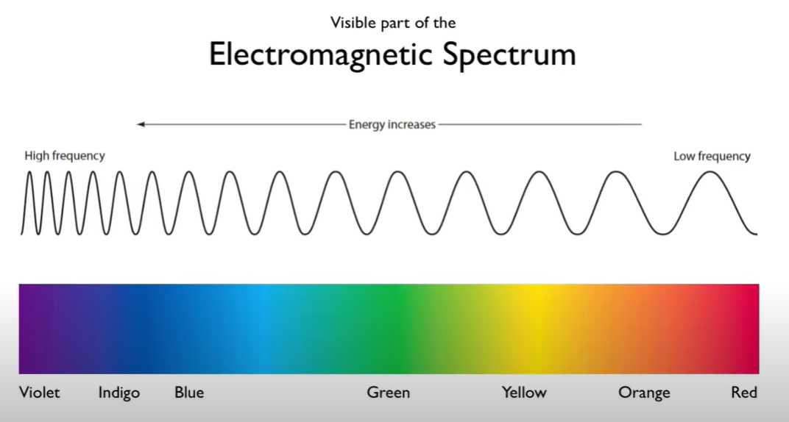

## The Light Spectrum

**What is Light?**

- At its core, light is a form of electromagnetic radiation that's visible to the human eye. It plays an essential role in our ability to see the world around us.

**How Does Light Travel?**

- Light moves as a wave, traveling in straight lines called rays. These rays bounce off objects and enter our eyes, which is how we perceive our surroundings.
- The speed of light is approximately 299,792,458 meters per second in a vacuum, making it the fastest thing in the universe.

**The Spectrum of Light:**

- The light spectrum consists of a range of colors, often visualized as a rainbow. It spans from violet, with the shortest wavelengths, to red, with the longest.
- Beyond the visible spectrum, there are forms of light humans can't see, such as ultraviolet (UV) and infrared (IR) light.

**Wavelengths and Colors:**

- Light's color depends on its wavelength. Shorter wavelengths appear blue or violet, while longer ones look red or orange.
- White light, like sunlight, is a combination of all colors. When passed through a prism, it disperses into its individual colors, creating a spectrum.

**Luminosity and Perception:**

- Different colors have varying degrees of luminosity. For humans, yellow-green light seems the brightest due to the sensitivity of our eyes at those wavelengths.
- Objects appear colored based on the wavelengths they reflect. A red apple, for instance, absorbs all colors except red, which it reflects to our eyes.

## Interaction with Matter

When light encounters matter, several things can happen:

**Transmission:**

This refers to light passing through a material. The degree to which light is transmitted depends on the material's transparency. For instance, clear glass or water allows a significant amount of light to pass through, while opaque materials do not.

**Reflection:**

Reflection occurs when light bounces back after hitting a surface. This can be further categorized into:

- **Specular Reflection:** This is the reflection of light from a smooth, shiny surface where the light reflects at a single angle. Mirrors and polished metals typically exhibit this type of reflection.

- **Diffuse (Scattering) Reflection:** This happens when light reflects off a rough surface and scatters in many different directions. An example is how sunlight scatters in all directions after striking a rough surface like a wall or the ground.

**Absorption:**

When light strikes a surface and doesn't reflect or transmit, it gets absorbed. The absorbed energy often gets transformed into heat. The color we see on an object is usually the color that is not absorbed. For instance, a red apple absorbs all colors except red.

**Emission:** 

Emission refers to the production and release of light by a source. The sun, light bulbs, and fireflies are all examples of sources that emit light. The emitted light can then undergo other interactions like reflection, transmission, or absorption when it encounters other materials.

**The Importance of Light in Technology:**

- Light's properties are harnessed in various technologies, from fiber optics, which use light to transmit data over long distances, to lasers used in medical and industrial applications.