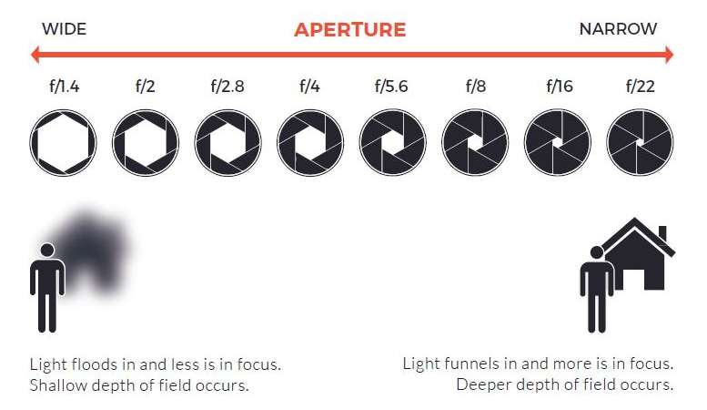
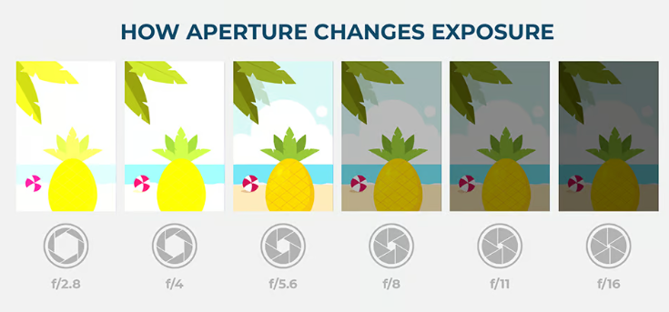
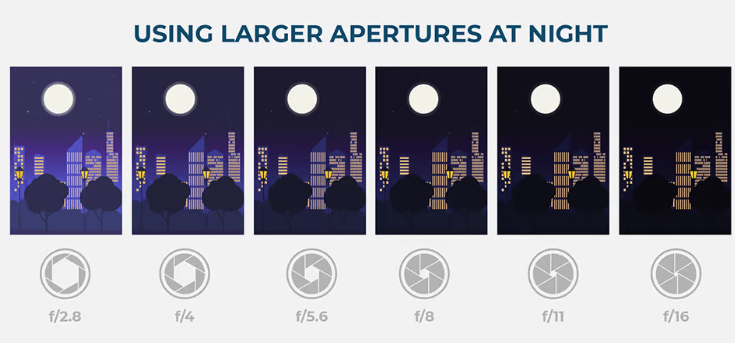
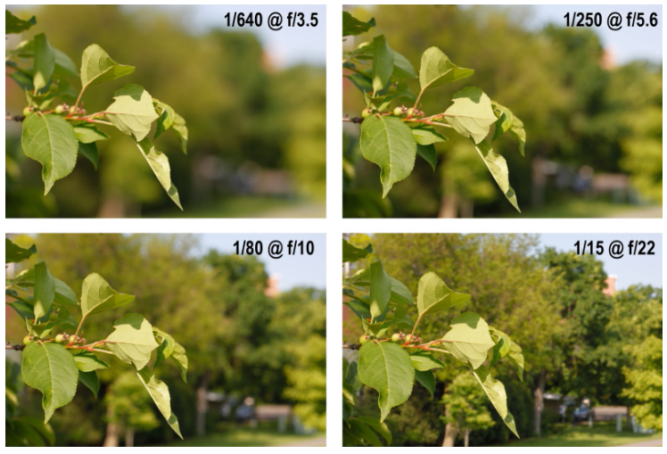

# Aperture

## Introduction to Aperture

Aperture refers to the opening in a camera lens through which light passes to enter the camera body and reach the sensor. It's a crucial component of photography, playing a significant role in exposure and depth of field. Aperture is measured in **f-stops** (e.g., f/2.8, f/4, f/16), and these numbers denote how wide or narrow the lens opening is, directly affecting the amount of light that can enter the camera.

The f-stop number is inversely related to the aperture size: the smaller the f-stop number, the larger the aperture opening, and vice versa. For example, an aperture of f/2.8 allows much more light to pass through the lens than an aperture of f/16. This principle is fundamental in controlling exposure; a larger aperture (small f-stop) will result in a brighter image, while a smaller aperture (large f-stop) will yield a darker image.

## Aperture's Impact on Depth of Field

One of the most significant effects of changing the aperture is the alteration of the depth of field (DoF), which refers to the range of distance within a photo that appears acceptably sharp. 

**A large aperture** (e.g., f/2.8) will produce a shallow depth of field, with only a small portion of the image in focus and the background and foreground blurred. This effect is particularly useful for portraits or when you want to isolate a subject from its surroundings. 

**A small aperture** (e.g., f/16) will yield a deeper depth of field, with a larger portion of the image from foreground to background appearing in focus, ideal for landscape photography.

## Reference

- https://photographylife.com/what-is-aperture-in-photography