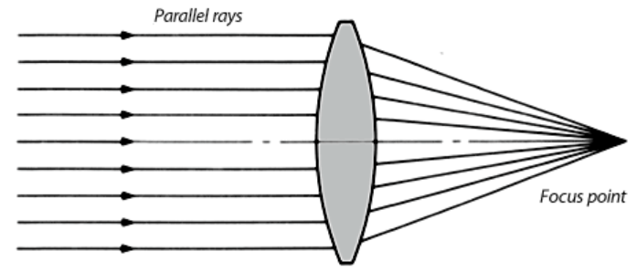
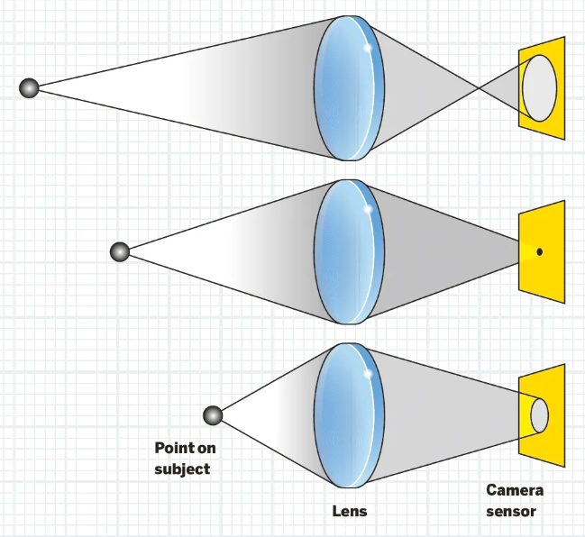
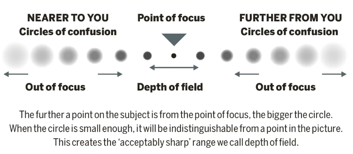
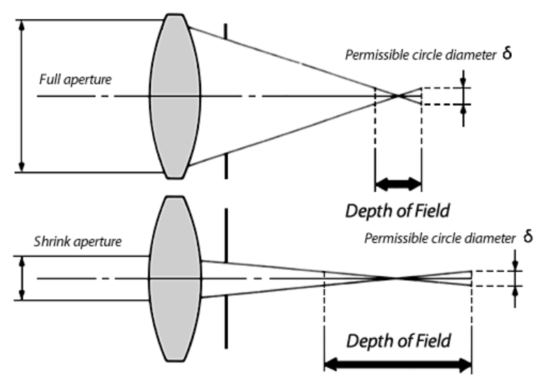
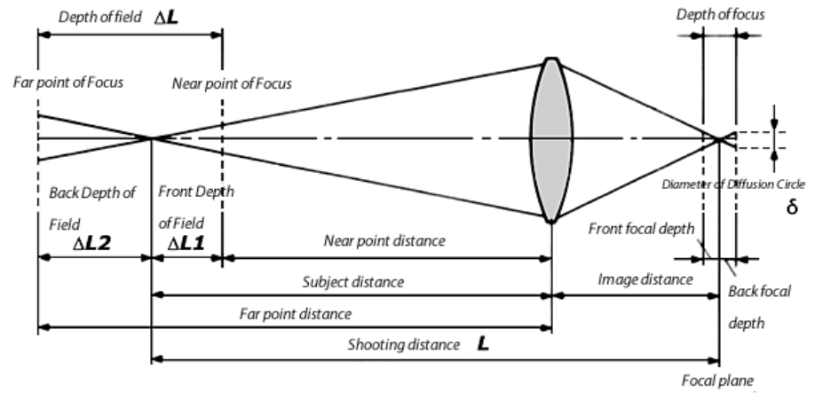
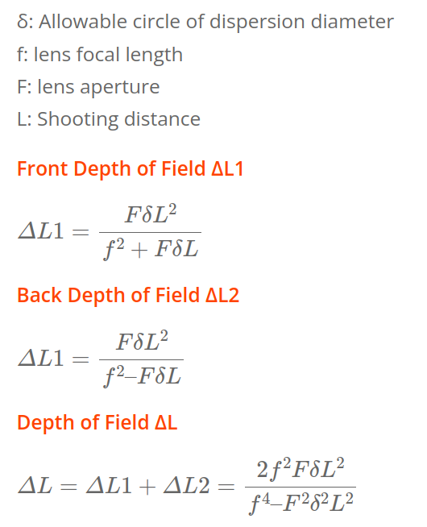

# Depth of Field

## The Circle of Confusion

### The Focus Point

When the light parallel to the optical axis enters the convex lens, the ideal lens should concentrate all the light at one point and then spread it out in a cone shape. This point where all the light is gathered is called the focal point.

### The Circle of Confusion

Imagine a single beam of light from a tiny, distant point shining through a camera lens. This light is focused by the lens to form a sharp dot on the sensor of the camera, which is ideally where the image is the clearest. Now, if we move this point of light closer or farther from the lens, it won't form a sharp dot anymore. Instead, it will create a blurry spot that looks like a small circle.

This blurry circle is called the "circle of confusion." When this circle is small enough, our eyes still perceive it as a point, and the image looks sharp. But if this circle gets too big, the point of light appears blurred, and the sharpness of the image is lost.

What we actually see in a photo or when we view an image on a screen has a lot to do with how big these circles of confusion are. If these circles are smaller than what our eyes can distinguish as individual points, the image looks sharp. If they're larger, the image starts to look blurry.

## The Depth of Field

When taking a photo, there's a specific area that will be in clear focus. This area has a certain distance before and after the exact spot you've focused on, which is usually your main subject. This span, where everything looks sharp and clear, is what photographers call the **Depth of Field** (DoF).

The DoF consists out of:
- a **focus point**, the point you want to capture and will be your most sharp point in the image you capture.
- a **circle of confusion (CoF) focus limit size**, the treshold of when something becomes blurry which has a start and end distance (radius from the focus point):

The same circle of confusion (sharpness) but a different DoF area:  
(shallow = small sharp area,  wide = larger sharp area)

## Factors Affecting Depth of Field

The blurry zone varies from image to image depending on a number of variables, including aperture, sensor size, and subject distance.

### 1. Distance To The Subject

The closer the camera is to the subject, the shallower the DoF. Moving away from the subject increases the DoF.

#### Small distance from focus point => Small DoF area:

#### Medium distance from focus point => Medium DoF area:

#### Large distance from focus point => Large DoF area:

### 2. Sensor Size / Focal Length

**Sensor Size**: Cameras with larger sensors can achieve a shallower DoF at the same aperture and framing compared to cameras with smaller sensors.

**Focal Length**: Longer lenses (higher focal length) decrease the DoF, making it easier to isolate subjects from the background. Shorter lenses (wider angles) increase DoF, keeping more of the scene in focus.

> [!CAUTION]
> TODO: Add new images

### 3. Aperture (f-stop)

**Aperture (f-stop)**: The aperture size directly influences DoF. A wider aperture (smaller f-number, e.g., f/2.8) results in a shallower DoF, blurring background and foreground objects outside the focus area. A smaller aperture (larger f-number, e.g., f/16) increases DoF, bringing more of the scene into focus.

## Calculate The Depth of Field

Online calculation tools here:

- https://www.omnicalculator.com/other/depth-of-field#how-to-use-the-dof-calculator
- https://dofsimulator.net/en/

## References

- [Dylan Bennett (MBoffin): A Simple Guide to Depth of Field](https://www.youtube.com/watch?v=34jkJoN8qOI)
- https://www.linkedin.com/pulse/understanding-depth-field-guide-aperture-focus-pyx-photography/
- https://pps.innovatureinc.com/depth-of-field-guide-for-beginners/
- https://www.ipsecu.com/articles/depth-of-field/
- https://www.specim.com/how-to-calculate-the-depth-of-field-dof-with-the-specim-hyperspectral-cameras/
- https://www.digitalcameraworld.com/tutorials/photography-cheat-sheet-what-are-circles-of-confusion