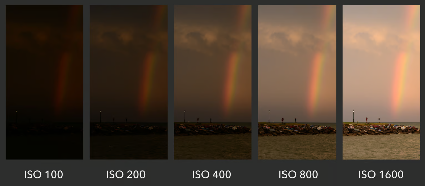
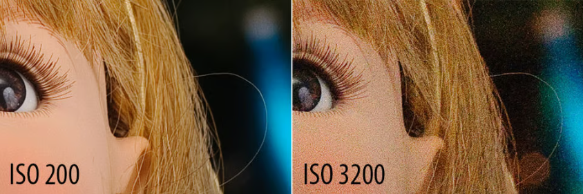
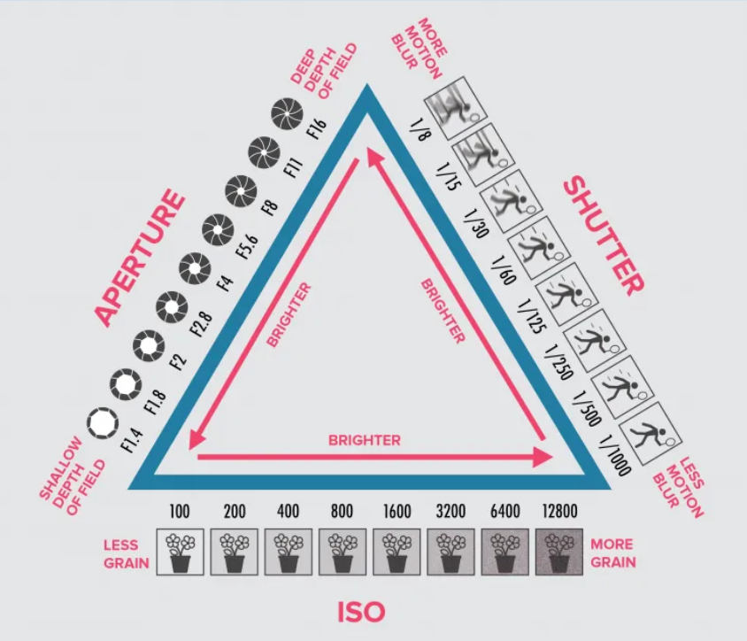

# ISO

## Understading ISO

ISO, in photography, is a measure of the camera sensor's sensitivity to light. Originating from the International Organization for Standardization, which standardizes sensitivity ratings for camera sensors, ISO plays a pivotal role in the exposure triangle, alongside aperture and shutter speed. Adjusting the ISO setting allows photographers to manage the exposure of their images under varying lighting conditions, thereby affecting the image's brightness and overall quality.

## ISO Values

ISO values typically start from a base level (e.g., 100 or 200) and increase in increments, doubling each time (200, 400, 800, 1600, etc.). The lower the ISO number, the less sensitive the camera is to light, and the finer the grain, resulting in a clearer, more detailed image. Conversely, a higher ISO number increases the sensor's sensitivity, allowing for photography in lower light conditions without resorting to a slower shutter speed or wider aperture. However, this increased sensitivity comes at the cost of higher noise or grain in the image, which can detract from image quality.

## ISO and Exposure

ISO is a crucial tool for managing exposure without altering motion (shutter speed) or depth of field (aperture). In bright conditions, a low ISO helps prevent overexposure, while in dim or indoor settings, increasing the ISO allows you to capture images without needing excessively slow shutter speeds, which could lead to motion blur, or extremely wide apertures, which could affect the depth of field.

Raising your ISO has consequences. A photo taken at too high of an ISO will show a lot of grain, also known as noise, and might not be usable. So, brightening a photo via ISO is always a trade-off.

The difference is clear – the image at ISO 3200 has much more noise than the one at ISO 200 (which I brightened with a long shutter speed instead). This is why you should avoid high ISOs whenever possible, unless conditions require you to use them.

## Best Practices for ISO Settings

- **Start Low**: Begin with the lowest ISO setting possible for your lighting conditions to ensure the highest image quality.

- **Increase as Needed**: Only increase ISO when you cannot achieve the desired exposure with shutter speed and aperture adjustments alone

## The Exposure Triangle

The exposure triangle consists of three key elements—ISO, shutter speed, and aperture. These interact to determine the exposure of a photograph:

- **Aperture** controls the lens' opening size, affecting the depth of field and the amount of light entering the camera. Lower f-stop numbers indicate a larger aperture, which increases light and reduces depth of field.

- **Shutter Speed** determines how long the camera's shutter is open to expose light to the sensor. Faster speeds freeze motion but let in less light, while slower speeds blur motion and increase light exposure.

- **ISO** measures the sensor's sensitivity to light. Lower ISO values produce less noise and require more light, ideal for well-lit conditions. Higher ISO values increase sensitivity and noise, useful in low-light conditions but potentially reducing image quality.

Balancing these settings allows photographers to achieve the desired brightness, motion blur, and depth of field in their images. Adjusting one element requires compensatory changes in the others to maintain proper exposure, offering a blend of technical control and creative expression in photography.

## References

- https://photographylife.com/what-is-iso-in-photography
- https://iamseptembermelody.medium.com/a-dummies-quick-guide-to-the-exposure-triangle-f6b9b716ef3e