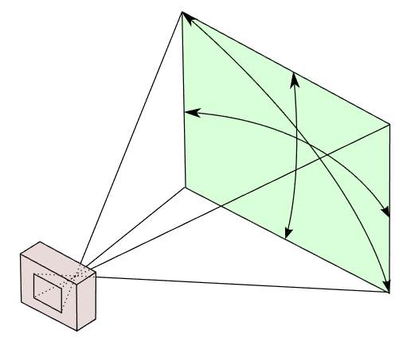
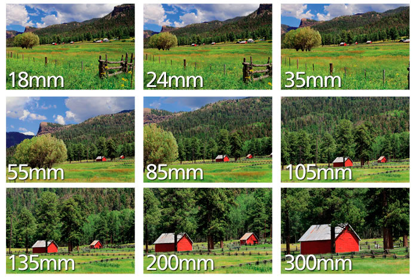
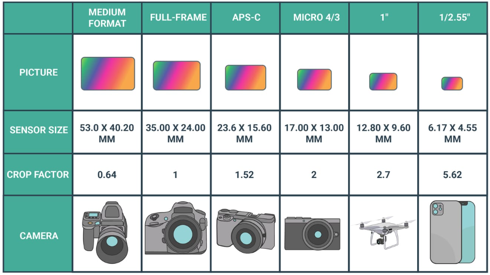
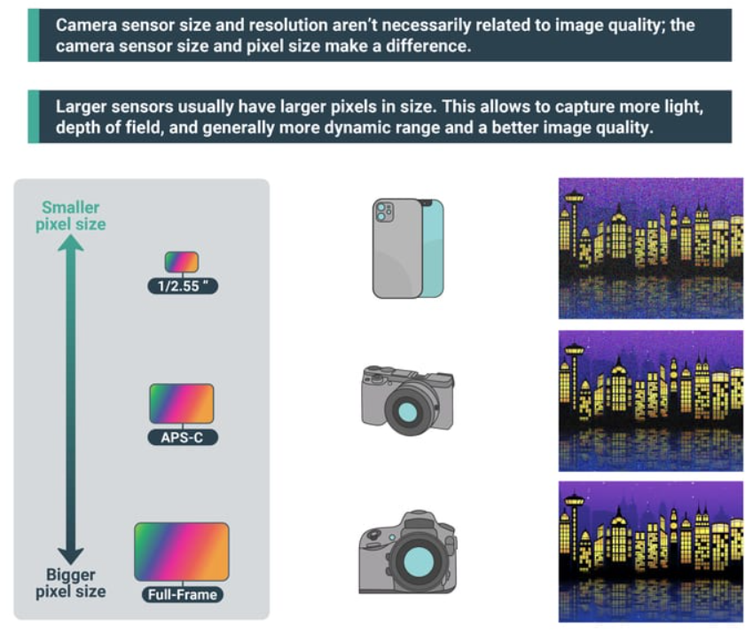
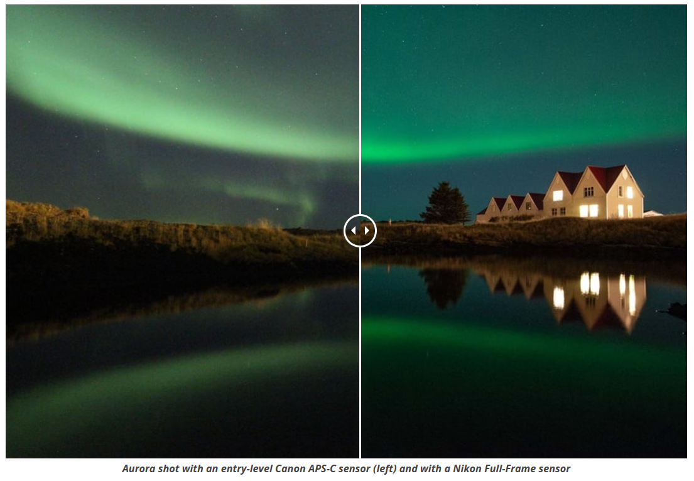
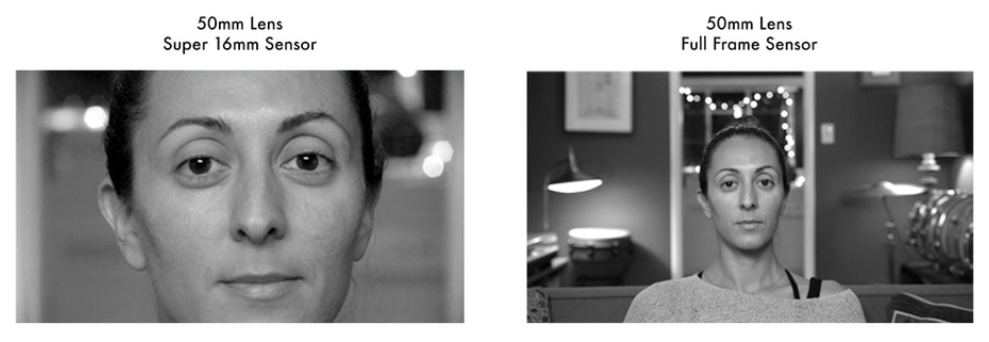
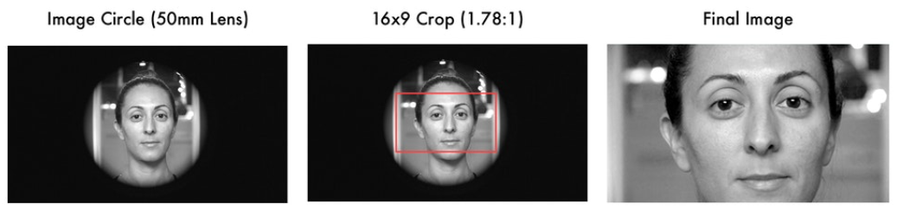
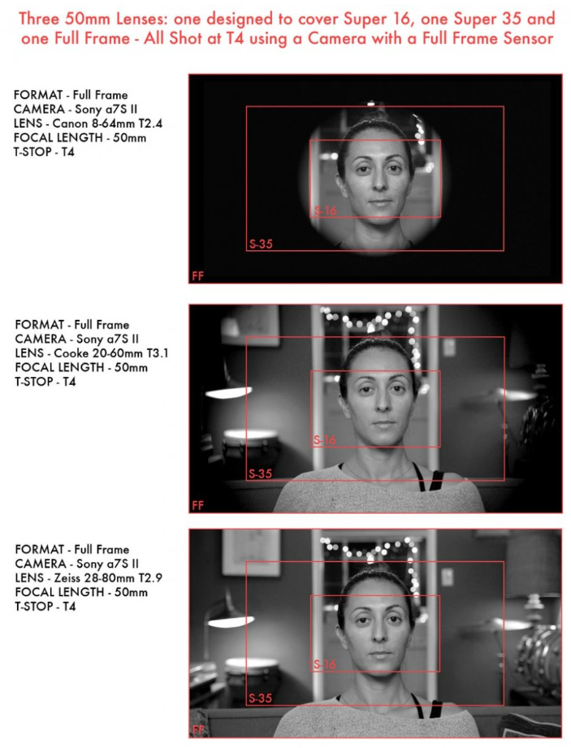
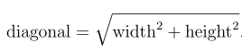
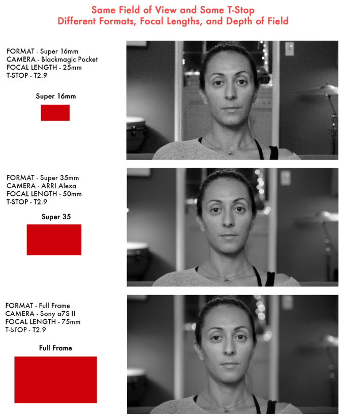

# Lenses

## What Is Focal Length?

Focal length is the distance, measured in millimeters (mm), between the point of convergence of your lens and the sensor or film recording the image. The focal length of your digital camera lens determines the lens's **angle of view** (how much of the scene will be captured) and the **magnification** (how large individual elements will be).  Smaller numbers have a wider angle of view and show more of the scene, while larger numbers have a narrower angle of view and show less.

A camera's angle of view can be measured horizontally, vertically, or diagonally:

## How Does Focal Length Affect an Image?

Focal length impacts the look and quality of a photograph in several ways:

**1. Field of view:** Focal length determines how much of a scene is captured in an image. Shorter focal length lenses are called wide-angle lenses because they allow you to get a wider field of view in one image. Lenses with long focal lengths are called telephoto lenses, and have a smaller field of view.

**2. Depth of field:**
Lenses with long focal lengths tend to have a shallow depth of field, which means they can focus in on small objects (even faraway ones) at specific distances. Meanwhile, lenses with short focal lengths have a larger depth of field, which enables them to get a wider range of elements in focus.

**3. Perspective:** Focal length can also change the perspective and scale of your images. A lens with a shorter focal length “expands” perspective, giving the appearance of more space between the elements in your photo. Meanwhile, telephoto lenses tend to stack elements in the frame together to “compress” perspective.

**4. Image shake:** Image shake is the blurriness and reduction in image quality that occurs from the vibration of pressing down the shutter release. When using a lens with a long focal length and tight perspective, your lens and camera are more sensitive to the slightest motion. Image shake can be prevented by using a tripod.

## Focal Length Comparison in Camera Lenses

There is a wide variety of camera lenses, and therefore different focal lengths, available to budding photographers. Certain lenses are better suited to certain types of photography; for example, ultra-wide angles are great for landscape photography whereas telephotos are a better option for wildlife photography.

**1. Ultra wide angle (focal length 8mm to 24mm):** These lenses are sometimes called fisheye lenses, which have a very wide viewing area. While they can take an image of up to 180 degrees around the lens, they distort the image quite significantly, making everything appear almost as if inside a sphere.

**2. Standard wide angle (focal length 24mm to 35mm):** Smaller focal lengths and a wider angle can distort images. With a lens of this size, distortion is minimal and the image appears more natural. Pretty much everything is in focus unless your subject is very close to the camera and there is less spatial distortion than a very wide lens, but it still makes things seem farther away than they actually are.

**3. Standard lens (focal length 35mm to 70mm):** These versatile lenses are good for just about any type of photography, from portraits to landscapes. These all-in-one lenses render images roughly the way the human eye sees the world, and easily adjust to a shallow or deep depth of field, depending on aperture.

**4. Telephoto lens (focal lengths 70mm to 300mm or more):**  
These lenses are ideal for picking out a distant subject, the way a telescope does. Good for compressing your subject and the background, which makes the background appear much closer to the subject. Telephoto lenses quite often have a shallow depth of field unless everything you’re shooting is far away.

## Impact of Sensor Size

Sensor size is the physical size (area, not number of pixels) of a camera’s image sensor, usually measured in mm width x height (and sometimes inches).

For example, **full-frame sensor** size is often used as a baseline for crop factor . At 35x24mm, these sensors are the largest you’ll find in consumer models. Common full-frame camera brands include Sony, Canon, and Nikon, and most of the models are aimed at advanced and professional photographers.

If you want the biggest camera sensor sizes, you’ll need to be looking at **medium format**, which is a wider range, usually around 43.80 x 32.90mm to 53.0 x 40.20mm. From there large format also exists, but now we’re looking at six-figure prices. These camera sensor sizes are aimed at special needs, like for example, photographers that need an immense resolution for printing big images.

Larger sensors have: 

**1. Better Low-Light Performance**: Larger sensors have larger photosites (pixels), which can capture more light, leading to improved performance in low-light conditions and lower noise at higher ISO settings.

**2. Improved Dynamic Range**: A larger sensor can typically capture a wider range of light to dark, giving more details in the highlights and shadows, which is especially beneficial for high-contrast scenes.

**3. Shallower Depth of Field**: Larger sensors can achieve a shallower depth of field at the same aperture setting, allowing for better subject isolation and bokeh effects, a plus for portraits and macro photography.

**4. Better Color Range**: They can often capture images with more color information and subtler variations, which can be important for high-quality prints and detailed post-processing.

**5. Higher Resolution Potential**: Because there's more physical space, larger sensors can accommodate more megapixels without compromising on the size of individual photosites, balancing resolution with image quality.

## Same Focal Length, Different Sensor Size

The image on the left demonstrates how a 50mm lens on a Super 16mm sensor, a size much smaller than full-frame sensor which produces a tighter field of view, (resembling a zoomed-in effect). This occurs because the smaller sensor captures less of the lens's projected image, cropping the edges and making the subject appear larger within the frame without changing the shooting distance.

On the right, the same 50mm lens on a full-frame sensor yields a broader field of view, fitting more of the environment around the subject into the shot. This is typical of how a 50mm lens behaves on a full-frame sensor, offering a medium close-up view.

This side-by-side illustrates crop factor in practice. To calculate it, divide the diagonal of a full-frame sensor by that of the smaller sensor. The crop factor (around 3x for Super 16mm) is then multiplied by the lens's focal length to find the equivalent focal length on a full-frame sensor. For example, a 50mm lens on a Super 16mm sensor acts like a 150mm lens on full-frame (50mm x 3). The actual crop factor depends on the exact dimensions of the sensor.

## Resolution & Pixel Count

For digital sensors, resolution is s the number of individual pixels on a given sensor that contribute to the final image. This can be measured in horizontal x vertical. For instance 1920 x 1080 is the standard pixel count for HD cameras.

We can abbreviate these numbers by using “Ks” (2K, 4K, 6K, 8K etc.). For instance 4K represents roughly 4,000 pixels in the horizontal axis of a 4K image sensor. I say “roughly” since a common “4K” resolution is actually 3840 x 2160 pixels, and there are multiple pixel counts that are accepted as “4K.”

In still photography, resolution is frequently expressed in "megapixels," where one megapixel equals one million pixels. For example, the Canon 5D Mark IV, with its 30.4-megapixel sensor, has around 30,400,000 pixels, arranged in a grid of 6720 pixels wide by 4480 pixels high. If we were to apply the "K" terminology based on horizontal resolution, it could loosely be referred to as 6.7K.

Expanding on this, several additional factors are important when considering sensor size and resolution:

- **Pixel Size**: Larger sensors not only allow for more pixels but can also accommodate larger pixels. Larger pixels can capture more light, improving dynamic range and reducing noise, which is especially beneficial in low-light conditions.

- **Sensor Technology**: The type of sensor (CCD or CMOS) and its design (Backside-Illuminated or BSI, Stacked, etc.) also play a role in the sensor's light-gathering efficiency and, consequently, its performance.

- **Image Processing**: The camera's image processor and its algorithms for handling noise reduction, sharpening, and other adjustments significantly affect the perceived resolution and detail in the final image.

## Image Circle & Lens Coverage

A lens’ image circle refers to the light or image projected out of the rear side of a lens. A lens projects a circular image, not rectangular. We simply crop the circular image into rectangular shapes with various aspect ratios. The diameter of the image circle is measured in mm. It is very helpful to know a lens’ image circle, because if you know the image circle, you know how large of a sensor a lens can cover. 

If a lens's image circle is too small for the sensor, the corners of the sensor will not be exposed, this is known as **vignetting**.

When using lenses designed for smaller sensors on a full-frame camera, the image circle is not large enough to cover the entire sensor, leading to the darkened corners seen in the image. This is problematic when the intention is to utilize the full capabilities of the full-frame sensor, especially if the desired output is a high-resolution image with a wide field of view, like in 4K resolution.

In the images below it’s easy to observe this lens’ complete image circle.

A lens is designed to "cover" the sensor size or film format it was made for, as well as any smaller formats. But most lenses won't cover sensor sizes larger than what they were designed for:

### Calculate The Image Circle:

To determine if a lens is designed for a camera's sensor, you need to know two key pieces of information:

- The sensor size of the camera.
- The image circle that the lens is designed to cover.

The sensor size of a camera is usually described in terms of its physical dimensions. For example, a full-frame sensor typically measures 36mm x 24mm. The image circle of a lens must be large enough to cover this sensor size. The image circle needed to cover a full-frame sensor is approximately the diagonal of the sensor.

To calculate the diagonal of a full-frame sensor, you can use the Pythagorean theorem:

The diagonal of a full-frame sensor is approximately 43.27mm. Therefore, any lens used with this sensor needs to have an image circle that is at least this diameter to cover the sensor completely without any vignetting.

If you have the specifications of the lens, namely the image circle it is designed to cover, you can compare it to the diagonal of the camera's sensor. If the lens's image circle is equal to or greater than the sensor's diagonal measurement, the lens is designed for that camera. If it's smaller, the lens is not suitable for the full-frame sensor, and vignetting will occur.

## Depth of Field

Depth of field (DoF) is a critical component of visual storytelling, influencing the viewer's focus and the aesthetic of the image. It varies with sensor size, lens aperture, and focal length:

- **Smaller Sensors**: Such as 2/3" or Super-16, yield a greater depth of field, keeping both the background and foreground in comparative focus. This characteristic suits scenarios where detail throughout the scene is important, like in landscape photography or when capturing wide environmental context in documentaries.

- **Larger Sensors**: Including Super-35 and Full Frame, produce a shallower depth of field. This aesthetically separates the subject from the surroundings by rendering out-of-focus backgrounds and foregrounds, a technique often employed in portrait and narrative filmmaking to draw attention to the subject and add a three-dimensional feel.

To maintain a consistent field of view with varying sensor sizes while controlling DoF, adjustments to lens choice and aperture settings are necessary:

- **Aperture Adjustments**: A wider aperture (lower f-stop number) on a lens results in a shallower depth of field, and vice versa. Changing the aperture is a common, swift method to modify DoF during shooting.

- **Focal Length Considerations**: When using larger sensor sizes, longer lenses are typically needed to achieve the same field of view. This shift to a longer focal length can also decrease the depth of field, further accentuating subject isolation.

- **DoF and Sensor Size Correlation**: For instance, shooting with a Full Frame sensor at T2.8 can result in a depth of field comparable to a Super-35 sensor at T1.4. Understanding this relationship ensures creative intentions are met without compromising the desired visual outcome.

## References

- https://photographylife.com/what-is-focal-length-in-photography
- https://capturetheatlas.com/what-is-focal-length/
- https://capturetheatlas.com/camera-sensor-size/
- https://vmi.tv/blog/learn-help/guide-to-sensor-sizes-and-lens-formats/