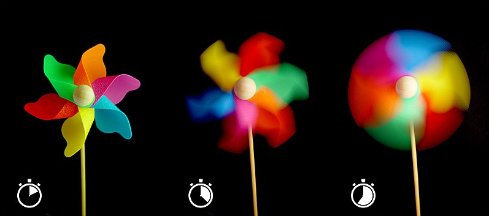
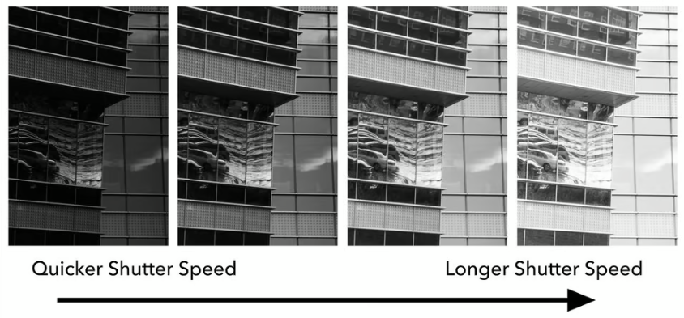
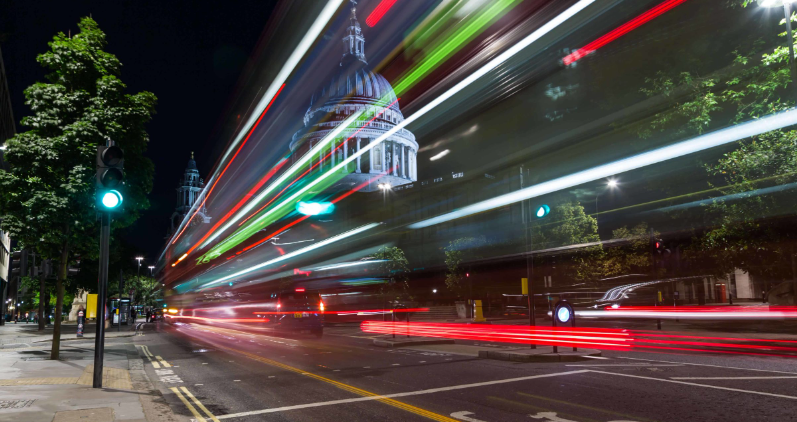
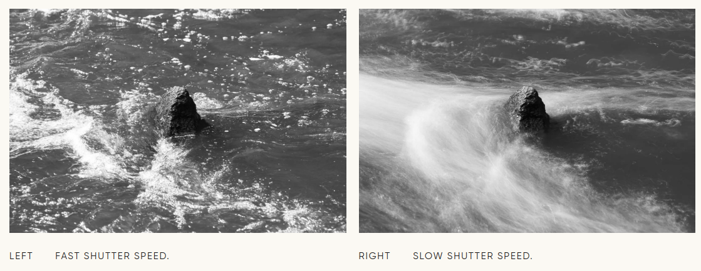
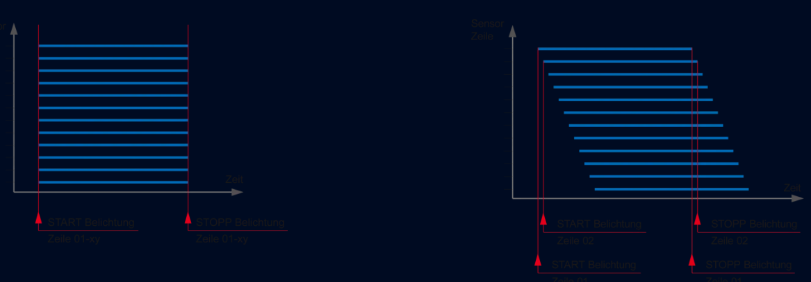
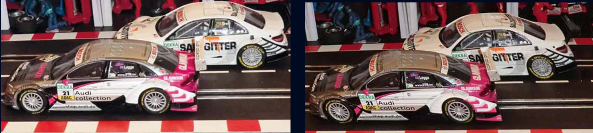

# Shutter Speed

## Introduction to Shutter Speed

Shutter speed, also known as "exposure time," refers to the length of time a camera's shutter is open to expose light onto the camera sensor. Measured in seconds or fractions of a second (e.g., 1/500). Shutter speed not only affects the brightness of a photo but also plays a significant role in capturing motion.

## How Shutter Speed Works

When you press the shutter button on a camera, the shutter opens and allows light to hit the sensor, recording an image. The duration that the shutter remains open is the shutter speed. Fast shutter speeds let in less light, while slow shutter speeds allow more light, affecting the exposure of the photograph.

## The Impact of Shutter Speed on Images

**1. Motion Blur**: Slow shutter speeds can create a motion blur effect, which is perfect for showing motion in subjects like waterfalls or cars. Conversely, fast shutter speeds can freeze motion, making them ideal for sports photography or capturing fast-moving animals without blur.

**2. Light and Exposure**: Shutter speed directly influences the amount of light that reaches the sensor, affecting the image's overall exposure. Slow speeds result in brighter images, while fast speeds produce darker images.

**3. Creative Effects**: Beyond exposure and motion, shutter speed can be used creatively to convey a sense of movement, alter the mood of an image, or focus attention on specific elements of a scene.

## Shutter Speed Recommendations

- **Fast-moving subjects**: Use a fast shutter speed (1/500s or faster) to freeze motion.
- **Low light conditions**: A slower shutter speed (1/60s or slower) can help capture more light, but may require a tripod to prevent camera shake.
- **Portraits**: Moderate speeds (1/60s to 1/250s) are typically sufficient, balancing light capture and motion freezing.
- **Landscapes**: Slow speeds (1s to 30s or longer), possibly using a tripod, can capture detailed scenes with dynamic elements like flowing water.

## Shutter Types

### Global Shutter

Cameras with a global shutter capture the entire image simultaneously. When the shutter is triggered, every pixel on the sensor starts and stops exposure at the exact same moment. This uniform exposure ensures that moving objects are captured without distortion, making global shutters ideal for fast-action photography, such as sports or high-speed events, and for scientific and industrial applications where precise motion capture is crucial.

### Rolling Shutter

Cameras with a rolling shutter capture the image sequentially, one row or column of pixels at a time, rather than all at once. This means that the top of the image is captured slightly before the bottom (or the left before the right, depending on the sensor orientation). While this method is more efficient and less costly to implement, it can lead to distortions in images of fast-moving objects or when the camera itself moves rapidly during exposure.

## Reference

- https://photographylife.com/what-is-shutter-speed-in-photography
- https://www.baslerweb.com/en/Learning/camera-selection/