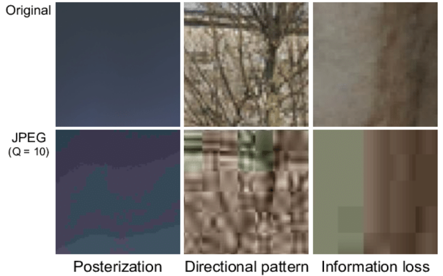

# File Formats

## Common Terminology about Images & Formats

- **Resolution**: The number of pixels in an image, typically denoted as width x height (e.g., 1920x1080).
- **Aspect Ratio**: The ratio of the width to the height of an image.
- **Color Depth (Bit Depth)**: Refers to the number of bits used to represent the color of a single pixel. For example, an 8-bit image can display 256 colors per channel, while a 16-bit image can display 65,536 colors per channel, allowing for smoother gradients and more detailed color representation.
- **Compression**: The technique used to reduce the file size of an image. Lossy compression (like JPEG) reduces file size by removing some image data, while lossless compression (like PNG) reduces file size without losing any image data.
- **Alpha Channel**: A component of an image that represents transparency. Used in formats like PNG and EXR.
- **Dynamic Range**: The range between the darkest and lightest parts of an image. Higher dynamic range means more detail in shadows and highlights.
- **File Size**: The amount of storage space an image file requires. Influenced by resolution, color depth, and compression.

## JPEG (Joint Photographic Experts Group)

JPEG is a commonly used method of lossy compression for digital images. The degree of compression can be adjusted, allowing a selectable tradeoff between storage size and image quality. Since its introduction in 1992, JPEG has been the most widely used image compression standard in the world.

#### Use Cases:

- **Web and Digital Media**: JPEGs are commonly used for web content due to their efficient compression, which reduces file size and speeds up page loading times.
- **Compatibility**: Virtually every photo viewer, editing tool, and device in existence supports JPG files, making the format a safe choice for most applications.

### Key Characteristics of JPEG/JPG

#### Compression:

- **Lossy Compression**: JPEG uses lossy compression, which reduces file size by permanently discarding some image data. The degree of compression can be adjusted, balancing between image quality and file size.

- **Compression Ratio**: Typically, a high compression ratio (e.g., 20:1) results in smaller file sizes but lower image quality, while a low compression ratio (e.g., 5:1) maintains higher quality at the cost of larger file sizes.

- **Small file sizes**: Due to compression, JPEG files are generally smaller in size, reducing the download size of your application or game.

- **Fast loading times**: The small file sizes allow JPEG images to load quickly in web or mobile applications.

#### 24-bit Color Depth:

- **Channels**: JPEG images typically use three color channels—Red, Green, and Blue (RGB).
- **Bits per Channel**: Each channel in a standard JPEG image is allocated 8 bits.
- **Total Bit Depth**: With 8 bits per channel, the total bit depth for a JPEG image is 24 bits (8 bits for Red + 8 bits for Green + 8 bits for Blue).

Resulting in a total of 16.7 million possible colors. This 8-bit depth has been sufficient for most consumer and web-based applications due to its balance between image quality and file size.

#### No Alpha Channel:

JPEG does not support transparency. Images requiring transparency (alpha channel) need to use formats like PNG or GIF.

#### Disadvantages:

- **Lossy Compression**: JPEG compression results in data loss. Repeated saving of a JPEG file can degrade image quality over time, which is unsuitable for iterative edits.
- **Limited Editing Capabilities**: Not ideal for extensive post-processing due to compression artifacts and reduced color information.
- **No Transparency Support**: JPEGs cannot store transparency, making them unsuitable for images requiring alpha channels.

## PNG (Portable Network Graphics)

PNG (Portable Network Graphics) is a popular format that supports lossless data compression. PNG is widely used for web graphics, image editing, and various digital applications due to its versatility and high-quality image preservation.

### Use Cases

- **Web Graphics**: PNG is ideal for web graphics requiring transparency, such as logos, icons, and buttons. Its lossless nature ensures that the quality is maintained.

- **Digital Art and Photography**: PNG's support for high bit depths and lossless compression makes it suitable for digital art and detailed photographs that need high fidelity and frequent edits.

- **Screenshots**: PNG is perfect for screenshots due to its ability to capture sharp text and interface elements without quality loss.

- **Data Visualization**: Charts, graphs, and other data visualizations benefit from PNG's clarity and sharpness, ensuring that fine details are preserved.

### Key Characteristics of PNG

- **Lossless Compression**: PNG uses lossless compression, meaning no image data is lost during the compression process. This ensures the highest possible image quality, even after multiple edits and saves.

- **Bit Depth**: PNG supports multiple bit depths, including 8-bit and 16-bit per channel. This allows for a range of color depths from simple grayscale images to highly detailed, full-color images.

- **Transparency**: One of PNG's standout features is its support for transparency through an alpha channel. This enables varying levels of transparency, allowing for smooth edges and complex overlays.

- **Interlacing**: PNG supports interlacing, a method of progressive loading that improves user experience by displaying a low-quality version of the image while the full-quality image loads.

### Disadvantages:

- **Larger File Size**: Compared to JPEG, PNG files can be significantly larger, especially for high-resolution images, leading to increased storage and bandwidth usage.
- **Not Ideal for High-Resolution Photos**: The file size can become impractical for detailed photographic images where the benefits of lossless compression are less noticeable.
- **Limited High Dynamic Range Support**: Not suitable for storing HDR images needed in advanced rendering and compositing.
- **No Native CMYK Support**: PNG is primarily an RGB format and does not support CMYK color spaces, which are often used in professional printing.

### More on bit depth

PNG (Portable Network Graphics) supports various bit depths, allowing for different levels of color precision and detail. Here's a breakdown of the bit depth options available in PNG:

#### 8-bit PNG / 32-bit PNG

- Commonly refers to 24-bit color images with an additional 8-bit alpha channel, providing transparency information. This format includes 8 bits each for red, green, blue, and alpha channels.
- Contains a palette of 256 colors, where each pixel references a color from a palette of 256 possible colors.
- Total bit depth for color and transparency is 32 bits per pixel.

#### 16-bit PNG / 64-bit PNG

- Refers to images with 16 bits per channel, resulting in a total of 48 bits for color representation (16 bits each for red, green, and blue).
- Total bit depth for color and transparency is 64 bits per pixel.
- Provides greater color precision and smoother gradients, which is beneficial for professional photography, digital art, and scientific imaging.

#### Integer vs. Floating Point

- **PNG**: Only supports integer values for bit depth (8-bit and 16-bit per channel). **It does not support floating point values.**

- **OpenEXR**: Supports both 16-bit and 32-bit floating point per channel, which allows for a much wider dynamic range and higher precision, making it ideal for HDR imaging and complex visual effects.

Info: PNG 16-bit INTEGER vs EXR 16-bit FLOATING POINT

## EXR (OpenEXR)

OpenEXR is a high-dynamic-range (HDR) image file format developed by Industrial Light & Magic (ILM). It is designed to store a wide range of color and luminance levels, making it ideal for visual effects, computer graphics, and professional imaging applications. OpenEXR supports multiple channels and high-precision data, which are crucial for complex rendering and compositing tasks.

### Use Cases:

- **Visual Effects and Compositing**: OpenEXR is extensively used in VFX and compositing pipelines due to its ability to store multiple channels and high dynamic range data. It allows for detailed compositing and color grading.

- **High Dynamic Range Imaging (HDRI)**: Used for creating HDR images and environments, OpenEXR captures the full range of real-world lighting conditions, essential for realistic rendering and lighting.

- **Scientific and Medical Imaging**: The format's precision and support for additional data channels make it suitable for applications requiring detailed image analysis and visualization.

- **3D Rendering and Animation**: OpenEXR is used in 3D rendering pipelines to store rendered frames with all necessary auxiliary data, ensuring high-quality final output.

### Key Features of OpenEXR:

- **High Dynamic Range (HDR) Support**: OpenEXR can store a vast range of luminance levels, preserving details in both the brightest highlights and darkest shadows. This makes it suitable for HDR imaging workflows.

- **Multiple Channels**: The format supports an arbitrary number of channels, allowing it to store not only color data (RGB) but also additional data such as alpha (transparency), depth, normals, motion vectors, and more.

- **High Precision**: OpenEXR supports 16-bit and 32-bit floating-point data per channel. The 16-bit "half" format provides a good balance between precision and storage requirements, while the 32-bit "float" format offers maximum precision. The floating point (instead of integer representation, like of PNG) allows for a much wider dynamic range and higher precision, making it ideal for HDR imaging and complex visual effects.

- **Lossless and Lossy Compression**: OpenEXR supports several compression methods, including lossless compression algorithms (ZIP, PIZ, and RLE) and lossy compression (B44 and B44A), allowing for flexibility in storage and performance.

- **Multi-Part and Tiled Images**: OpenEXR can store multi-part images, which allows different parts of an image to be stored separately within the same file. It also supports tiled images, enabling efficient access to large images by dividing them into smaller tiles.

- **Metadata Support**: OpenEXR files can include metadata, such as color profiles, camera settings, and custom attributes, which can be useful for managing and processing image data.

- **Multithreading Support**: OpenEXR is designed with multithreading capabilities, allowing for faster file reading and writing by leveraging multiple CPU cores. This can significantly speed up processing times, especially with large files. JPEG and PNG formats typically do not have native multithreading support, resulting in slower performance for large files compared to OpenEXR. 

### Disadvantages:

- **Large File Size**: EXR files are large, reflecting the detailed information they store. This can lead to significant storage requirements.
- **Complexity**: Handling EXR files requires specialized software and knowledge, making them less suitable for simple tasks.
- **Not Suitable for Web Use**: EXR is not supported by web browsers and is impractical for online content due to its size and complexity.

## TIFF (Tagged Image File Format)

TIFF (Tagged Image File Format) is a versatile, high-quality raster image format created in the mid-1980s by Aldus Corporation, later acquired by Adobe. Designed to be flexible and adaptable, TIFF was created for industries like professional photography, publishing, and scanning, where retaining image quality, precise color information, and metadata is essential.

TIFF was developed to solve the need for a standardized format that could store high-quality, uncompressed or losslessly compressed images without losing detail. By supporting high bit depths, flexible compression options, and extensive metadata, TIFF remains a staple in industries requiring precision and quality preservation.

### Use Cases for TIFF

- **Professional Photography**: Preserves image quality for high-resolution photos, making it ideal for post-processing and archival storage.
- **Printing and Publishing**: Preferred for print-ready assets due to support for CMYK color spaces and high-quality detail retention.
- **Medical and Scientific Imaging**: Suitable for storing large, detailed scans (e.g., X-rays, MRI) where data precision is essential.
- **Document Scanning**: Frequently used in digitizing documents and historical materials for its high-resolution capabilities and metadata support.

### Key Features of TIF

- **High Bit Depth Support**: TIFF supports a wide range of bit depths, including 1-bit, 8-bit, 16-bit, 24-bit, 32-bit, and even 64-bit (16 bits per channel for RGBA).

- **Lossless and Lossy Compression**: Supports various compression methods, including lossless (LZW, PackBits, ZIP) and lossy (JPEG). The choice of compression affects file size and quality.

- **Multiple Image Layers**: TIFF files can store multiple images or layers within a single file, making it suitable for complex image editing tasks.

- **Extensive Metadata**: TIFF can embed extensive metadata, including EXIF, IPTC, and XMP, which is crucial for professional and archival purposes.

- **Multi-Platform Support**: Widely supported by various operating systems and image editing software, ensuring broad compatibility and ease of use.

### Disadvantages of TIFF

- **Large File Sizes**: Due to high bit depths and lossless compression, TIFF files can be much larger than JPEG or PNG, affecting storage and load times.
- **Limited Web Compatibility**: Not suitable for web use due to size and lack of widespread browser support.
- **Complexity**: TIFF’s features make it more demanding in terms of file handling and software requirements compared to simpler formats like PNG or JPEG.

### Comparison with PNG

While both TIFF and PNG are lossless formats, they cater to different needs:

- **File Size**: PNG files are generally smaller, suitable for web and digital media, while TIFF is preferred for print-quality, detailed images.
- **Bit Depth**: TIFF supports higher bit depths (up to 32-bit), making it suitable for HDR and detailed texture work, while PNG maxes out at 16-bit.
- **Transparency and Layers**: Both support transparency, but TIFF's layering support makes it ideal for complex edits and compositing.
- **Color Space**: TIFF supports a wider range of color spaces, including CMYK, which is necessary for print, whereas PNG is mainly RGB-focused.

## References

- https://skientia.co/cgi/image-formats#:~:text=In%20A%20Nutshell,%2Dbit%20or%2016%2Dbit%20.