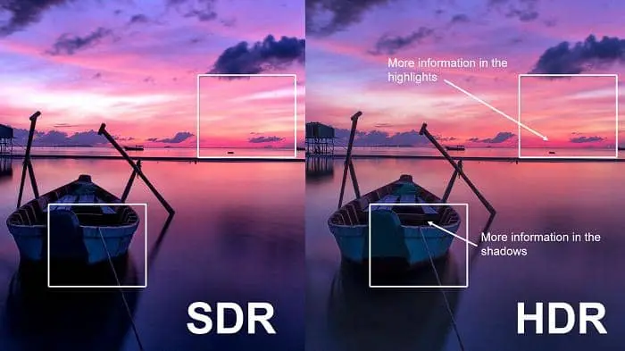
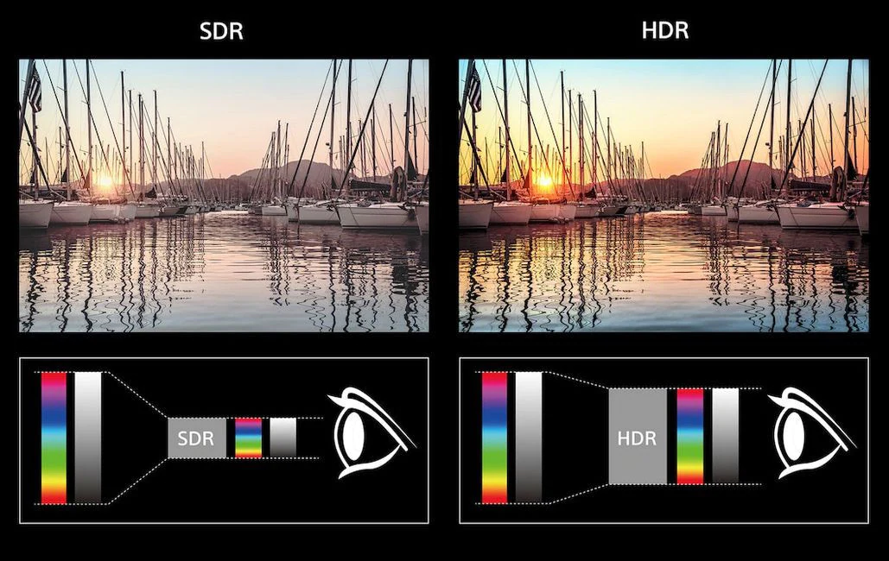
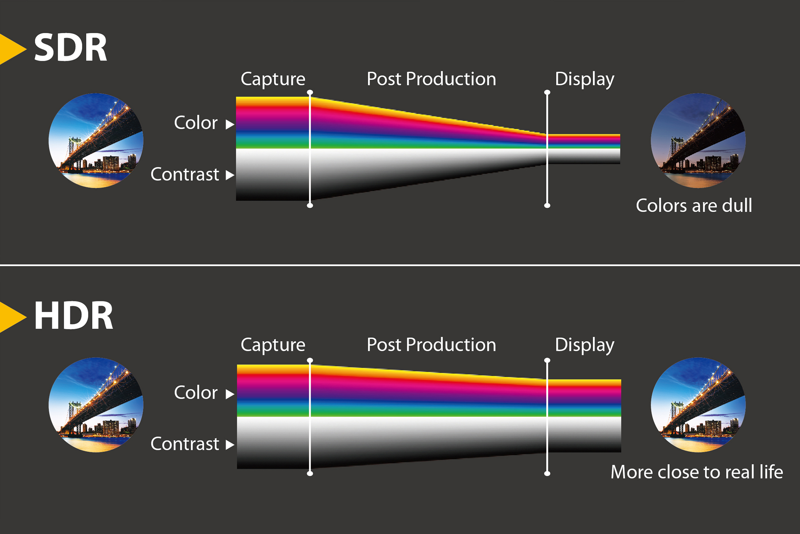

## Nits

Nits are a unit of measurement used to describe the brightness of a display. Specifically, a nit is a unit of luminance, equivalent to one candela per square meter (cd/m²). The term "nit" comes from the Latin word "nitere," which means "to shine."

In the context of displays, especially when talking about HDR (High Dynamic Range), nits are used to quantify how much light the screen can emit. This is significant because the greater the number of nits, the brighter the display can be. Here's what you should know about nits:

**Brightness Levels**: Standard dynamic range (SDR) displays typically range from 100 to 300 nits, which is sufficient for most indoor viewing situations. HDR displays, however, can have peak brightness levels significantly higher — 1000 nits or more — allowing for a much broader range of light and dark areas within an image.

HDR Standards: Different HDR standards may require different levels of peak brightness. For instance, HDR10 content is often mastered for 1,000 nits, while Dolby Vision content may be mastered for higher levels, even up to 10,000 nits, to accommodate future advancements in display technology.

**Perceived Brightness**: The human eye does not perceive changes in brightness linearly; doubling the nits does not necessarily appear twice as bright to our eyes. High nit values are particularly important for the bright highlights that make HDR content stand out.

**Outdoor Visibility**: High-nit displays are also beneficial for outdoor use in bright sunlight, where higher brightness is needed to see the screen clearly.

**Energy Consumption**: Generally, the higher the brightness a display can achieve, the more power it consumes, especially if displaying HDR content with bright highlights over extended periods.

## What is SDR

SDR, or **Standard Dynamic Range**, refers to a range of display specifications and media content that has been the norm for many years in television, cinema, and computer displays. It's defined by a relatively limited range of brightness levels and color space. Here’s a detailed breakdown of SDR's characteristics:

### Luminance Range

**Brightness Levels**: SDR content is typically mastered for displays that have a peak brightness around 100 nits. This is far less than the capabilities of modern HDR displays, which can exceed 1,000 nits or more for the brightest highlights.

### Color Gamut

**Color Space**: SDR commonly uses the **Rec. 709 color space**, which was standardized for HD content. While this color space has served well for high-definition video, it covers a smaller gamut of colors compared to what **HDR color spaces like Rec. 2020** offer.

### Bit Depth

**Color Depth**: SDR usually employs an 8-bit color depth, which translates to 256 levels per color (red, green, and blue) and results in about 16.7 million possible colors. While sufficient for many applications, this can lead to banding in gradients and less smooth transitions between colors than what is possible with the 10-bit or higher depth used in HDR.

### Gamma Curve

**Transfer Function**: SDR uses a gamma transfer function to map the linear light intensities captured by cameras to the non-linear light output of displays. This gamma curve compensates for the way CRT displays worked and also mimics the non-linear way in which human vision perceives light and dark.

### Dynamic Range

**Contrast Ratio**: The dynamic range in SDR is relatively limited, meaning the difference between the darkest and brightest parts of the image isn't as pronounced as in HDR. This can lead to details being lost in shadows or highlights in high-contrast scenes.

### Implementation and Compatibility

**Widespread Use**: SDR has been the standard for decades, which means that most content, distribution channels, and displays are equipped to handle SDR. This includes everything from broadcast television to online streaming.

**Consistency**: SDR provides a consistent look across different devices and environments, partly because it was designed to perform well under a wide range of viewing conditions.

### Limitations

The limitations of SDR have become more apparent as display technologies have advanced. The contrast ratio is low by modern standards, and the color gamut is not as wide as what newer technologies can offer. As a result, SDR cannot reproduce the full range of luminance and colors that human eyes can perceive and that cameras can capture.

### Role in Current Media

Despite the rise of HDR, SDR is still very much in use. It remains the baseline for content consumption on many devices, especially older equipment that isn't HDR-capable. Additionally, for environments with controlled lighting, like movie theaters, SDR can still provide a high-quality viewing experience. However, as HDR becomes more prevalent, the role of SDR may diminish, with it eventually serving as a legacy format.

## What is HDR

HDR, or **High Dynamic Range**, represents a set of technologies that significantly expand the range of both contrast and color compared to Standard Dynamic Range (SDR) systems. Here’s a detailed overview of HDR's characteristics:

### Luminance Range

**Brightness Levels**: HDR content is mastered for displays that can handle a much higher brightness level, typically from 1,000 nits to 10,000 nits or more. This expanded range allows for brighter highlights, which can enhance the realism and visual impact of an image.

### Color Gamut

**Color Space**: HDR often uses wider color gamuts such as **Rec. 2020** or DCI-P3, which can represent a broader spectrum of colors than the Rec. 709 color space used in SDR. This allows for more vivid and lifelike colors, particularly noticeable in areas like green landscapes or blue skies.

### Bit Depth

**Color Depth**: HDR content is generally associated with a 10-bit color depth or higher. This means each color channel (red, green, and blue) has 1,024 levels, resulting in over a billion possible colors. This depth reduces banding and allows for much smoother gradients.

### Gamma Curve

Transfer Function: Instead of the traditional gamma curve, HDR uses Perceptual Quantizer (PQ) or Hybrid Log-Gamma (HLG). These are non-linear optical-electrical transfer functions that allow for a more accurate representation of both bright and dark details, corresponding better to human vision.

### Dynamic Range

Contrast Ratio: HDR dramatically improves the contrast ratio, which is the difference between the darkest and brightest parts of an image. This leads to greater detail in both shadows and highlights, a sense of depth, and a more three-dimensional appearance.

### Implementation and Compatibility

**Emerging Standard**: While HDR is increasingly common, it’s not yet as universal as SDR. HDR content and display capabilities vary, and there are different HDR formats like HDR10, Dolby Vision, and HDR10+ that have different capabilities and requirements.

**Environmental Sensitivity**: HDR is best appreciated in a dark or controlled-lighting environment, where the enhanced contrast and color capabilities can be fully perceived. In brighter settings, the advantages of HDR might not be as noticeable.

### Limitations

**Hardware Requirements**: To fully enjoy HDR content, consumers need compatible displays and players. This often involves upgrading from older technology, which can be a barrier.

**Content Availability**: Although growing rapidly, the library of available HDR content is still smaller than that of SDR. Production of HDR content is more complex and requires newer technology and expertise.

**Standards Fragmentation**: There are multiple competing HDR standards without a single unifying format, which can lead to confusion for consumers and compatibility issues between devices and content.

### Role in Current Media

HDR is quickly becoming a sought-after feature for new televisions, gaming consoles, and movie production due to its ability to offer a more immersive and visually stunning experience. It's being adopted in cinemas, streaming services, and UHD Blu-rays, pushing the visual experience of movies and games closer to the full spectrum of human vision. However, the transition from SDR to HDR is still an ongoing process in the realm of content creation, distribution, and consumption.

