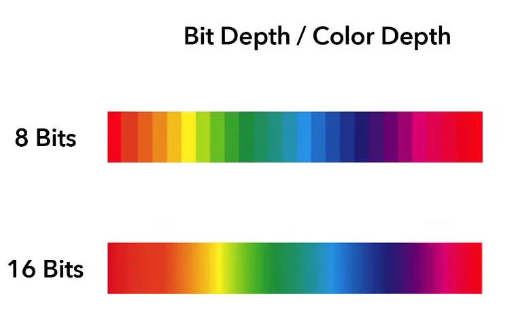
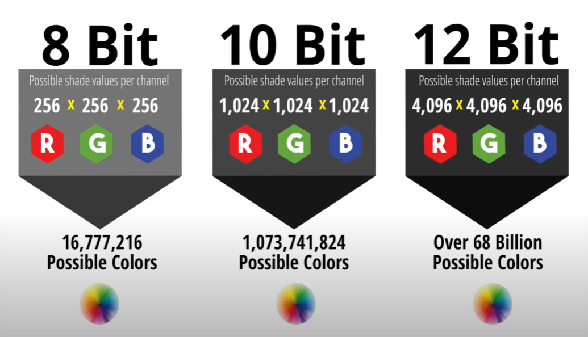
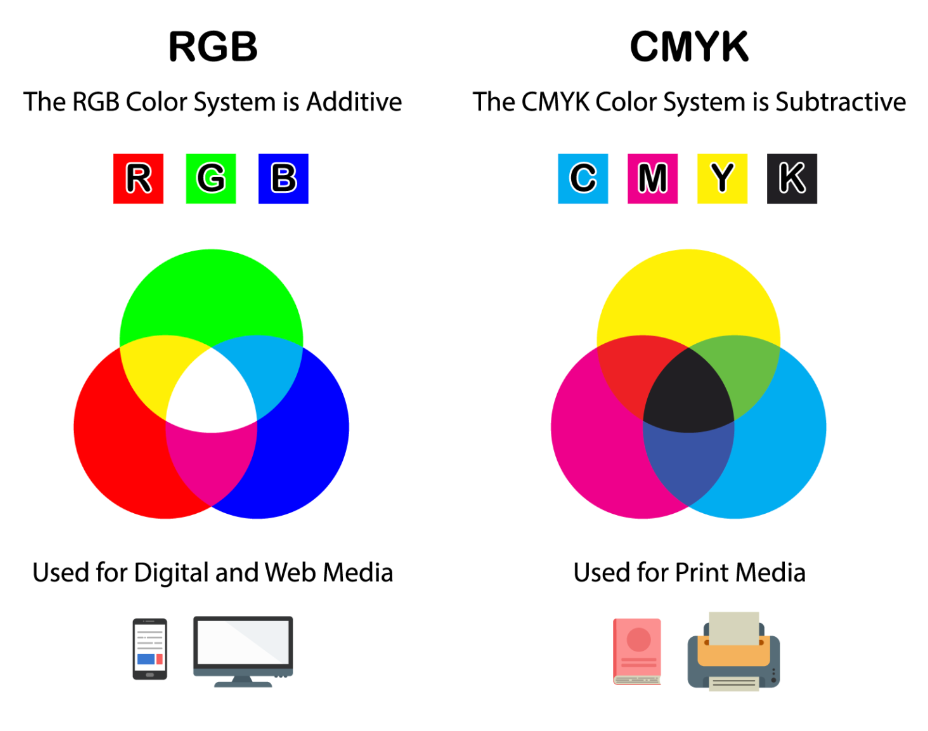

## Gamut 

Gamut refers to the entire subset of colors that can be accurately represented and reproduced within a given color space. It essentially defines the range of colors that a certain device (like a monitor, printer, or camera) can display or capture. When we say that one color space or format has a larger gamut than another, we mean that it can represent a wider range of colors.

### Why Can One Format Have a Larger Gamut Than Another?

The gamut is determined not by the bit depth but by the color space definition itself — that is, which colors are defined as the primary colors (red, green, and blue) and how saturated these colors are. For instance:

**sRGB:**

- **Purpose:** It's the most common color space for web browsers, TVs, cameras, and monitors.
- **Gamut Size:** Smallest of the three, it covers about 35% of the visible color spectrum.
- **Why It's Used:** sRGB is considered the default standard for images intended for the internet because it's well-suited to the characteristics of most consumer-grade displays and the conditions in which digital content is typically viewed.

**Adobe RGB:**

- **Purpose:** Created by Adobe Systems to encompass most of the colors achievable on CMYK color printers.
- **Gamut Size:** Larger than sRGB by about 50%, it covers a more significant portion of the visible spectrum.
- **Why It's Used:** Adobe RGB is preferred in printing and photography because it can represent richer greens and blues, offering a wider range of reproducible colors for high-quality prints.

**ProPhoto RGB:**

- **Purpose:** Designed to include almost all colors that the human eye can see, making it useful for high-end photo editing.
- **Gamut Size:** Largest of the three, it covers about 90% of the visible colors, though some of these colors are actually outside the human visual range.
- **Why It's Used:** ProPhoto RGB is favored by professional photographers and designers who need to work with a broad color palette for tasks like photo retouching, especially when the final output is going to be printed using high-fidelity techniques.

## Role of Bit Depth

While the gamut is about the range of colors available, bit depth is about the number of possible color values that can be assigned within that range. Bit depth determines how many variations of each primary color you can have, thus affecting the subtlety with which you can represent colors and the smoothness of gradients. For instance:

- **8-bit per channel**: This allows for 256 different shades of each primary color (red, green, and blue), which equates to over 16.7 million possible colors. While this is plenty for most applications, it can lead to banding in gradients because the steps between colors are sometimes large enough to be noticed.

- **16-bit per channel**: This provides 65,536 shades for each primary color, allowing for over 281 trillion possible colors. This makes banding virtually invisible and is much more suitable for high-dynamic-range imaging and extensive color grading.

## Color Models

### RGB Color Model

The RGB color model is based on the additive color theory, where colors are created by mixing different amounts of red, green, and blue light. This model is used in electronic displays, such as TVs and computer monitors:

- **Additive Process**: Combining red, green, and blue light in various ways to produce other colors.
- **Primary Colors**: Red, green, and blue.
- **Use Cases**: Anything that emits light, such as digital screens.

### CMYK Color Model

The CMYK color model is based on the subtractive color process used in color printing. Unlike RGB, which starts with black and adds color, CMYK starts with white (the paper) and subtracts color using ink:

- **Subtractive Process**: Unlike light, which can combine in various intensities to create colors (as with RGB), inks absorb and reflect light. The combination of these CMYK inks on paper subtracts varying degrees of red, green, and blue from the white light to produce a broad range of colors.
- **Primary Colors**: Cyan, magenta, yellow, and key (black).
- **Use Cases**: Color printing.

## Interesting Video's

- [sRGB or AdobeRGB Color Space? | Ask David Bergman - YouTube](https://www.youtube.com/watch?v=B2ZJx5eDUoc&ab_channel=Adorama)

