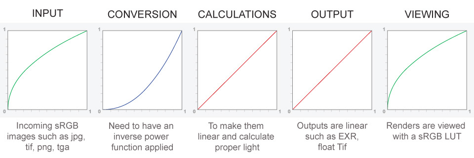
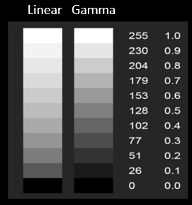

## sRGB: A Solution for Consistency

sRGB (standard Red Green Blue) is a standard color space that was created to provide a consistent color reproduction across different devices and platforms, addressing the gamma variance issue along with other inconsistencies in color representation.

## sRGB: Bridging the Gap

sRGB is widely recognized and utilized as the default color space for the internet, many computer applications, and consumer-grade cameras and monitors. The creation of sRGB was a collaborative effort between Microsoft and HP to develop a standard that would ensure a reliable color experience for consumers.

### Why sRGB?

- **Standardized Gamma**: sRGB specifies a gamma of approximately 2.2, which is a compromise that approximates a linear response for low-intensity values and provides a perceptual non-linearity for higher intensities. This makes it adaptable to a wide range of lighting conditions and devices.

- **Predetermined Primaries**: sRGB defines the exact chromaticity of its red, green, and blue primaries, which helps in delivering consistent colors across devices that adhere to this standard.

- **Defined White Point**: sRGB uses a defined white point, which is based on the D65 illuminant (6504 K). This means that "white" is the same across all sRGB-compliant devices, eliminating the variance that can occur with an undefined white point.

- **Broad Adoption**: Due to its early introduction and the influence of its creators, sRGB has been broadly adopted by manufacturers, making it a de facto standard for consumer devices and the internet.

### Addressing Gamma with sRGB

sRGB's standard gamma curve addresses the variance of gamma across devices by defining a specific transformation curve. This curve dictates the relationship between the values encoded in an image file and the luminance output on a display. By adhering to this standard, devices can more reliably reproduce the intended appearance of images.

**INPUT:** The journey begins with the input; images arrive in their initial encoded format (such as JPEG, TIFF, PNG, TGA), which is based on the sRGB gamma curve. This standardization is foundational, as it presumes that the images conform to the sRGB color profile, ensuring a consistent starting point.

**CONVERSION:** To allow for accurate color manipulation, the image must first be converted into a linear color space. This conversion entails applying an inverse gamma correction (or inverse power function) to the sRGB image. This step effectively removes the sRGB encoding gamma curve, rendering the pixel values linear. Linearization is crucial for performing any kind of color-sensitive operation, such as compositing or 3D rendering, as it ensures that light interactions and color blending behave in a physically accurate manner.

**CALCULATIONS:** Once linearized, the image is in an ideal state for precise calculations, enabling accurate lighting adjustments, blending, and other forms of image manipulation. Working in a linear space means that these calculations are based on how light actually behaves, producing realistic and predictable results.

**OUTPUT:** After these processes, the images are saved in a linear format, like EXR or floating-point TIFF. These formats retain the high dynamic range and the linear nature of the color information, which is necessary for further post-processing or long-term storage without losing the accuracy of the manipulations applied.

**VIEWING:** Finally, for the purpose of display, the image is re-encoded back into the sRGB color space. This re-encoding applies the sRGB gamma curve once again so that the image takes into account the characteristics of typical display devices, ensuring that viewers see the image as intended, with the correct gamma curve applied for their screens.

This workflow ensures that despite the initial gamma variance challenge, the image remains consistent in its appearance from creation to consumption. The sRGB standard acts as a reference point throughout this process, ensuring that what creators see during editing is what viewers will see on their sRGB-calibrated screens.

In essence, by adopting the sRGB color space and its defined gamma, the industry has created a reliable ecosystem that manages to keep colors consistent across various platforms and devices, thus making sRGB an essential part of digital color workflows.

## Limitations of sRGB: 

While sRGB is widely adopted and provides a common standard that helps in ensuring consistent color reproduction across different devices, it is not without its limitations. Here are some of the notable constraints associated with sRGB:

### Technological Limitations and Evolution

- **Display Technology and Gamma Encoding**: Initially, gamma encoding was essential due to the non-linear response of CRT displays to voltage, which was not directly proportional to the emitted brightness. This method compensated for the display's characteristics, ensuring that the stored signal would correctly represent brightness levels when viewed.

- **Bit Depth and Banding Issues**: With early digital systems restricted to 8-bit color depth, gamma encoding helped minimize banding by allocating bits more efficiently, based on human visual sensitivity to shadows rather than highlights.

### Color Space Constraints

- **Limited Color Gamut**: sRGB's color gamut is narrower than what modern displays and professional applications can support, which restricts the range of colors available for high-end usage such as digital cinema and professional photography.

- **Suboptimal for HDR**: sRGB does not accommodate the wider brightness and color range of HDR content, which requires a color space that can handle greater luminance levels and a more extensive color palette.

### Consistency vs. Accuracy Trade-off

- **Overemphasis on Display Consistency**: sRGB's design prioritizes consistency across devices, which can lead to a compromise in true color accuracy, with devices potentially displaying colors that do not match the original source accurately.

- **Generalized Color Management**: sRGB's one-size-fits-all approach to color management does not leverage the capabilities of more advanced devices that can handle nuanced color profiles, limiting the accuracy and quality of color representation.

### Environmental Assumptions

- **Assumption of Standard Viewing Conditions**: sRGB assumes a specific set of viewing conditions, including a certain white point and ambient lighting. Deviations in actual viewing environments can result in perceived color discrepancies.

Due to these limitations, other color spaces like Adobe RGB, ProPhoto RGB, and DCI-P3 have been developed and are used in contexts where a wider gamut or different gamma response is necessary. These color spaces provide better options for high-end photography, printing, and video production where the limitations of sRGB are too restrictive.

## Gamma to Linear: Better Image Accuracy

The prevalent use of gamma encoding in digital imaging has its roots in the early days of broadcasting and the limitations of CRT displays. However, as technology advanced, the limitations of gamma encoding became apparent, necessitating a shift towards a more precise and accurate method of image handling: linear encoding.

### Understanding the Limitations of Gamma Encoding

Gamma encoding was developed as a solution to the non-linear way CRT screens reproduced brightness, as well as to efficiently use the limited bandwidth of broadcast signals in accordance with human visual perception. However, this encoding presents challenges:

- **Non-Uniformity**: Gamma-encoded values do not represent linear light levels, making mathematical operations like blending or HDR processing complex and non-intuitive.
- **Precision Loss**: When images are encoded with gamma, subtle details may be lost, particularly in the dark and light areas of an image, leading to banding and loss of detail in shadows and highlights.

The transition from gamma to linear space in digital imaging is a response to the evolving needs of more advanced image processing and the limitations of gamma encoding. Here's a more detailed look into how linear space fits into the picture, especially considering that sRGB and most other color spaces are traditionally gamma-encoded:

### Linear Color Space: The Basics

Linear color space is a method of representing colors as they are in real life, where the numeric value of a color directly correlates to the amount of light that color emits. This means that if you double the numeric value of a color in linear space, it will appear twice as bright. This is different from gamma space, where the relationship between the numeric value and brightness is non-linear.

### Why Linear Matters

- **Physically Accurate Computations**: Linear color space allows for physically accurate light calculations, which is crucial for rendering in computer graphics. When lights, shadows, and colors interact in a scene, linear space ensures that these interactions are calculated correctly, making the results more realistic.

- **High Dynamic Range (HDR)**: Linear space is more suitable for HDR imaging because it can represent a wider range of brightness levels—from very dark to very bright—more naturally. This ability is essential for capturing and displaying the full range of light in a scene, something that gamma space struggles with.

- **Complex Image Processing**: In advanced image editing and compositing, operations such as blurring, filtering, and anti-aliasing benefit from linear color space because it represents the physics of light more accurately. When these operations are performed in gamma space, they can produce incorrect results because the mathematical relationships between pixel values are distorted.

### How Linear Fits with sRGB

When working with sRGB images in a professional setting, a typical workflow involves:

1. **Conversion to Linear Space**: The sRGB images are converted from their gamma-encoded space to linear space before any processing begins.

2. **Image Processing**: All edits, color corrections, composites, and effects are applied while the image is in linear space.

3. **Gamma Encoding**: After all the processing is complete, the image is converted back to a gamma-encoded space for distribution and display.

This workflow is commonly used in software that requires high precision in color handling, such as photo editing software, video color grading tools, and 3D rendering applications. By working in linear space, these tools ensure that the lighting and color operations are as accurate as possible.

In essence, the transition to using linear space is not about replacing sRGB or gamma space entirely; it's about utilizing the best of both worlds. Linear space is used for the processing stage to achieve accuracy and realism, and gamma space is used for the encoding stage to match the display technology and viewing conditions.