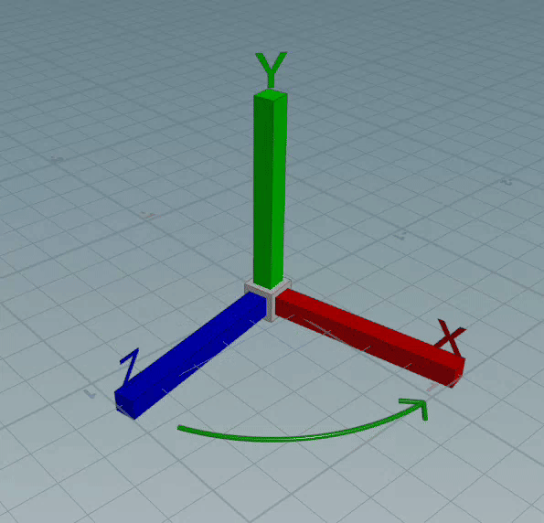
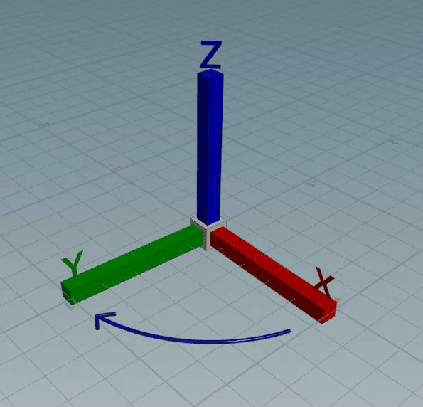

# 3D Coordinate Systems

## Cartesian Coordinate System

At the heart of 3D graphics lies the Cartesian coordinate system, a mathematical construct that uses three axes (X, Y, Z) to define any point / position in 3D space.

- **X-Axis**: Represents the horizontal direction.
- **Y-Axis**: Represents the vertical direction.
- **Z-Axis**: Represents the depth.

## Left-Handed vs. Right-Handed Systems

Houdini and Unreal use two different coordinate systems.

- **Houdini** uses a **Y-up right handed** coordinate systems (unit: meter)
- **Unreal** uses a **Z-up left handed** coordinate systems (unit: centimeter)

   
(Houdini (left) and Unreal (right) coordinate systems)

The orientation of the coordinate system axes can follow either a left-handed or right-handed convention. It's pretty simple: 
- Turing the **left hand** results in turning clock-wise.
- Turing your **right hand** results in turning anti-clock-wise.

So for example with the **Right-Handed System**: If you align your right hand so that the index finger points along the positive X-axis, the middle finger along the positive Y-axis, and the thumb points along the positive Z-axis.

(left hand & right hand)

## Coordinate Spaces in Graphics Programming

> [!CAUTION]
> TODO

## Transformations

## Translation

> [!CAUTION]
> TODO

## Rotation

> [!CAUTION]
> TODO

## Scale

> [!CAUTION]
> TODO

## References

- https://www.sidefx.com/docs/houdini/unreal/coordinates.html
- https://www.scratchapixel.com/lessons/mathematics-physics-for-computer-graphics/geometry/coordinate-systems.html