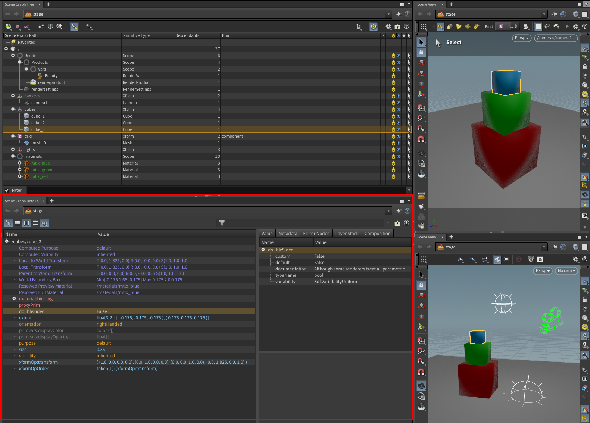

# Prims (Primitives)

- **Definition**: Prims are the fundamental building blocks in USD. They represent scene elements such as models, lights, cameras, groups and more.

- **Types of Prims**:
  - **Xform**: Represents a transformation node that can apply translation, rotation, and scaling to child prims.
  - **Mesh**: Defines polygonal geometry using vertices, faces, normals, and UVs.
  - **Scope**: A grouping prim that does not apply any transformations; used for logical organization.
  - **Camera, Light, Material**: Specialized prims that hold specific data for rendering.

- **Hierarchy**: Prims are organized in a hierarchical namespace, forming a tree structure akin to a filesystem. Prims can thus have parents/children which are also Prims.

- **Composition**: Prims can be composed using various composition arcs like references, inherits, and variants.

- **Creating Prims**: Prims are created on a USD stage and can have properties, metadata, and relationships.

- **Customization**: Prims can be extended using schemas to add custom behavior or data.

### Example of the Stage View in Houdini

Example of the stage view in Houdini where multiple prims are defined in a hierarchical way (parent/child relationship):


In the screenshot above, the Houdini Stage view shows a hierarchical structure of **Prims** that are organized in a tree format. Here's an overview of the various types of Prims and their arrangement:

- **Root Prim** (`/`): The root of the scene, serving as the top-most level.
  - **Render** (Scope): A grouping prim that organizes rendering-related elements, such as products and variables.
    - **Products** (Scope): A group of items related to rendering products, which contains:
      - **Vars** (Scope): A nested grouping prim.
        - **Beauty** (RenderVar): Represents a render variable, typically for beauty passes.
      - **Render Product** (RenderProduct): Defines a product to be generated by the renderer.
      - **Render Settings**: Holds specific settings used during rendering.
  - **Cameras** (Xform): A transformation node holding the camera.
    - **Camera1** (Camera): A specialized prim that represents a camera in the scene.
  - **Cubes** (Xform): A transformation prim containing multiple cube objects.
    - **cube_1**, **cube_2**, **cube_3** (Cube): These are the cube geometries, represented as mesh objects in the scene.
  - **Grid** (Xform, component kind): A transformation node labeled as a "component" that contains:
    - **mesh_0** (Mesh): A polygonal mesh object representing a grid.
  - **Lights**: A section for organizing lighting in the scene (empty in this example).
  - **Materials** (Scope): A grouping prim for materials, which contains:
    - **mtlx_blue**, **mtlx_green**, **mtlx_red** (Material): These are material definitions that apply specific shading to objects.

Each Prim in the tree has its **Primitive Type** (e.g., `Scope`, `Xform`, `Cube`, `Mesh`, etc.), a count of **Descendants**, and some have a **Kind** (e.g., "component" for the grid). The hierarchical structure in USD follows a parent-child relationship, where parent Prims can hold other Prims as children, allowing for complex scene organization.


The same stage view panel but from the the full Houdini desktop:


> [!NOTE]
> This file is available at the following location: `<repo-name>/reference/open_usd/cubes.hip`

# Properties

**Definition**: Properties are named data containers associated with prims. They can be either attributes (holding data values) or relationships (referring to other prims or properties).

### **Attributes**:

- **Data Types**: Attributes can hold various data types, including scalars (int, float), vectors (float3), matrices, arrays, and even custom types. For example, `size = 0.35` in the cube_3 prim defines a uniform scaling factor. Other attributes like `LocalToWorldTransform` store matrix data, representing the transformation from local space to world space.
- **Time-Sampled Data**: Attributes can store time-varying data, enabling animation by sampling attribute values over time.

In the screenshot, for `/cubes/cube_3`, you can see various attributes such as:
- **LocalToWorldTransform**: A matrix that defines the transformation from the cube’s local space to world space.
- **Visibility**: This attribute is set to `inherited`, meaning it follows the visibility settings from parent prims.
- **size**: A float attribute controlling the cube’s size.

### **Relationships**:

- **References** to other prims or properties, allowing for complex connections within the scene graph like material assignments or hierarchical structures. For example, the `Resolved Material` attribute points to `/materials/mtlx_blue`, showing how cube_3 is linked to a specific material.

### Example of the Properties in Houdini

Example of the scene graph tree view together with the scene graph details view:



# Paths

**Definition**: Paths are string representations that uniquely identify prims and properties within the USD scene hierarchy.

In the scene displayed in the screenshot, paths are visible in the **Scene Graph Path** column, where each prim, such as `/cubes/cube_3`, has a specific location in the hierarchy.

### Path Syntax:

Just like folders in a filesystem, paths in USD can be relative or absolute.

- **Absolute Paths**: Always starts with a `/` and provides the full path from the root. For example, the path `/cubes/cube_3` in the screenshot specifies the absolute path to the third cube in the scene.
- **Relative Paths**: These paths are relative to the current prim location. They start with a single dot `.` to specify the current prim location, or a double dot `..` to refer to the parent prim. If you were working within `/cubes/cube_3`, `../cube_2` would point to the second cube, which is a sibling of `cube_3`.

### Prim vs. Property Paths:

- **Prim Paths**: Refer to the location of a prim (an object or element) within the scene graph. For example, in the screenshot, `/cubes/cube_3` is the prim path identifying the third cube object under the `cubes` transformation group.
- **Property Paths**: Are extensions of prim paths that specify properties or attributes of the prim. For instance, the path `/cubes/cube_3.xformOp:translate` refers to the transformation operation that defines the translation of `cube_3` within the scene.

### The Role of the Colon `:` (Namespace)

In USD property paths, the colon `:` separates the property namespace from the property name. This allows for organized property management and avoids naming conflicts.

- **Namespace (xformOp)**: In the screenshot, the `xformOp` namespace is part of the property path, indicating a collection of transformation operations such as translation, rotation, and scaling.
- **Property Name (translate)**: Refers to a specific transformation operation within the `xformOp` namespace. For example, `xformOp:translate` would define the translation component of a transformation, while `xformOp:rotateXYZ` might handle rotation.

This structure is crucial for maintaining clarity when working with complex scenes involving numerous properties and transformations.

## Metadata

**Definition**: Additional static information attached to prims, properties or layers that provides context or supplementary data not directly affecting the scene's visual representation. Metadata can include details like documentation, authoring information, or any custom data that needs to accompany the scene elements.


## How do USD Prims look like?

Below is an example of a scene in the USD file format (`.usda` format), which is the ASCII (human-readable) representation of USD:

- Two cubes positioned side by side.
- A camera looking at the scene from above.
- A sunlight source shining down.

```
#usda 1.0
(
    defaultPrim = "world"
    metersPerUnit = 1
    upAxis = "Y"
)

def Xform "world"
{
    def Xform "cubes"
    {
        def Cube "cube_1"
        {
            double3 xformOp:translate = (0, 0, 0)
            float size = 0.5
            uniform token visibility = "inherited"
        }

        def Cube "cube_2"
        {
	    uniform token[] xformOpOrder = ["xformOp:translate"]
            double3 xformOp:translate = (0, 2.5, 0)
            float size = 0.7
            uniform token visibility = "inherited"
        }
    }

    def Xform "cameras"
    {
        def Camera "camera1"
        {
	    uniform token[] xformOpOrder = ["xformOp:translate", "xformOp:rotateXYZ"]
            double3 xformOp:translate = (0, 5, 15)
            double3 xformOp:rotateXYZ = (-15,0,0)
            float focalLength = 50.0
            float horizontalAperture = 24.0
            float verticalAperture = 18.0
        }
    }

    def Xform "lights"
    {
        def DistantLight "light1"
        {
            uniform token[] xformOpOrder = ["xformOp:translate", "xformOp:rotateXYZ"]
            double3 xformOp:translate = (0, 1.75, 5)
	    double3 xformOp:rotateXYZ = (-30, 0, 0)
            color3f inputs:color = (1, 0, 0)
            float inputs:intensity = 1
	    bool inputs:normalize = True
        }
    }
}
```

How it looks like in Houdini when loading it in:


