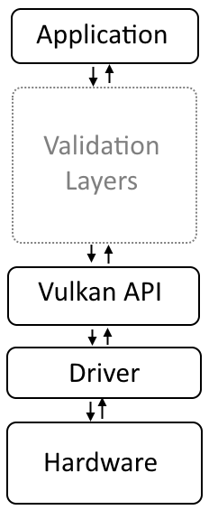

# About Vulkan

Vulkan is a modern, cross-platform, low-level graphics and compute API developed by the Khronos Group. It was released in 2016 as a successor to OpenGL, aiming to provide more efficient and flexible access to GPU resources for developers. Vulkan is designed for high-performance 3D graphics, as well as general-purpose computing tasks on the GPU.

## Khronos Group

The Khronos Group is an open standards consortium founded in 2000, consisting of various companies and organizations from the technology industry, including major hardware manufacturers, software developers, and academic institutions. The group's primary focus is on creating and maintaining open, royalty-free standards for graphics, parallel computing, virtual and augmented reality, and other related domains.

Even if you haven’t heard of Khronos, you’ve probably heard of some of their standards, such as: OpenGL, OpenGL ES, WebGL, OpenCL, SPIR, SYCL, WebCL, OpenVX, EGL, OpenMAX, OpenVG, OpenSL ES, StreamInput, COLLADA, and glTF.

The development of Vulkan within the Khronos Group follows the organization's commitment to open standards, ensuring that the API remains vendor-neutral and widely accessible. This approach has led to Vulkan's support on various platforms and its adoption by multiple GPU manufacturers, such as AMD, NVIDIA, Intel, and others.

## Origin of Vulkan

Vulkan has its origins in AMD's (Advanced Micro Devices) Mantle API, which was a low-level, high-performance graphics API developed in collaboration with game developers like DICE. Mantle was introduced in 2013, and its primary goal was to reduce driver overhead and improve the performance of games on AMD hardware. Mantle demonstrated the potential for low-level APIs to provide significant performance improvements over traditional APIs like OpenGL and DirectX 11.

In 2014, AMD announced that it would be contributing Mantle to the Khronos Group, an open standards consortium responsible for the development of APIs such as OpenGL, OpenCL, and WebGL. The goal was to create a new, cross-vendor, cross-platform graphics API based on Mantle's principles. This decision led to the development of Vulkan, which aimed to provide a low-level, high-performance graphics API that could be used across various platforms and GPU vendors.

Vulkan was officially announced by the Khronos Group on March 3, 2015, under the codename "GLnext" (indicating its role as the successor to OpenGL). The first official version, Vulkan 1.0, was released on February 16, 2016.

The development of Vulkan was driven by the industry's need for a more efficient and flexible graphics API that could better leverage modern hardware. Vulkan addressed this need by providing developers with more direct control over GPU resources and enabling better multi-threading capabilities. This allowed for significant performance improvements and better utilization of multi-core processors compared to traditional APIs like OpenGL and DirectX 11.

As graphics card architectures matured, they started offering more and more programmable functionality. All this new functionality had to be integrated with the existing APIs somehow. This resulted in less than ideal abstractions and a lot of guesswork on the graphics driver side to map the programmer's intent to the modern graphics architectures. That's why there are so many driver updates for improving the performance in games, sometimes by significant margins. Because of the complexity of these drivers, application developers also need to deal with inconsistencies between vendors. Aside from these new features, the past decade also saw an influx of mobile devices with powerful graphics hardware. These mobile GPUs have different architectures based on their energy and space requirements.

Vulkan is designed from the ground up to run on diverse platforms, ranging from mobiles and tablets, to gaming consoles and high-end desktops. The underlying design of the API is layered, or should we say modular, so it enables the creation of a common, yet extensible architecture for code validation, debugging, and profiling, without impacting performance. Krhonos claims the layered approach will deliver a lot more flexibility, catalyse strong innovation in cross-vendor GPU tools, and provide more direct GPU control demanded by sophisticated game engines.

## Graphics API Comparison

Here's a comparison between Vulkan, OpenGL, and DirectX:

### Platform Support

**Vulkan**: It is a cross-platform API, supporting Windows, Linux, Android, macOS, and iOS (via the MoltenVK library).

**OpenGL**: Also a cross-platform API, it supports Windows, Linux, macOS, and mobile platforms such as Android and iOS.

**DirectX**: Developed by Microsoft, it is primarily designed for the Windows ecosystem, including Xbox consoles. DirectX 12, the latest version, is available on Windows 10 and Xbox One.

### Performance and Low-Level Control

**Vulkan**: Offers low-level control over GPU resources, enabling developers to optimize their applications better, reducing driver overhead, and facilitating multi-threaded rendering. This leads to better performance, especially on modern hardware.

**OpenGL**: A higher-level API compared to Vulkan, it doesn't provide the same level of control over GPU resources, resulting in higher driver overhead and less efficient multi-threaded rendering.

**DirectX**: DirectX 12, like Vulkan, offers low-level control and is designed for high-performance graphics. However, older versions of DirectX (e.g., DirectX 11) are more comparable to OpenGL in terms of abstraction and performance characteristics.

### Learning Curve and Ease of Use

**Vulkan**: Due to its low-level nature, Vulkan has a steeper learning curve and can be more challenging to work with compared to OpenGL and older versions of DirectX.

**OpenGL**: As a higher-level API, OpenGL is considered easier to learn and use, making it a popular choice for beginners and educational purposes.

**DirectX**: DirectX 12's low-level nature makes it more challenging to work with, similar to Vulkan. However, older versions (e.g., DirectX 11) are considered easier to learn.

### Community and Ecosystem

**Vulkan**: As a relatively new API, its community and ecosystem are still growing. However, many game engines and middleware solutions have started adopting Vulkan due to its performance advantages.

**OpenGL**: Boasts a large and established community, with a wealth of resources, tutorials, and tools available. However, its relevance has diminished in recent years due to the rise of Vulkan and DirectX 12.

**DirectX**: A widely used API, particularly in the gaming industry, DirectX has a strong community and extensive support from both Microsoft and third-party developers.

## Vulkan Validation Layers

The Vulkan API was designed with performance in mind. One way to increase its performance is to lower state and error checking performed by the driver. This is one of the reasons Vulkan is called a "thin API" or "thin driver," it is a minimal abstraction of the hardware, which is required for the API to be portable across multiple hardware vendors and device types (high-performance desktop computers, mobile phones, and integrated and low-power embedded systems).

However, this approach makes creating applications with the Vulkan API much more difficult, compared to the traditional high-level APIs such as OpenGL. It's because very little feedback is given to developers by the driver, as it expects that programmers will correctly use the API and abide by rules defined in the Vulkan specification.

To mitigate this problem, Vulkan was also designed to be a layered API. The lowest layer, the core, is the **Vulkan API** itself, which communicates with the **Driver,** allowing us to program the **Hardware** (as seen in the preceding diagram). On top of it (between the **Application** and the **Vulkan API**), developers can enable additional layers, to ease the debugging process.

Vulkan validation layers are a set of optional components that help developers identify and diagnose incorrect API usage and potential issues in their Vulkan applications. The validation layers act as an intermediary between the application and the Vulkan driver, intercepting and validating API calls made by the application.

The validation layers help developers with this responsibility by providing real-time feedback on their application's behavior. They check for a wide range of issues, including:

- **Incorrect API usage**: Detecting cases where the application does not follow the Vulkan specification, such as providing invalid parameters or calling API functions in the wrong order.

- **Resource management**: Ensuring that the application manages GPU resources, such as memory, buffers, and textures, correctly, and does not leak or access resources after they have been released.

- **Synchronization**: Identifying potential issues related to synchronization between the CPU and GPU, such as incorrect use of fences, semaphores, or barriers.

- **Performance warnings**: Highlighting potential performance pitfalls or suboptimal API usage that may impact the application's performance.

## References

- [alain.xyz - Raw Vulkan](https://alain.xyz/blog/raw-vulkan#vertex-buffers): An overview on how to program a Hello Triangle Vulkan application from the ground up.