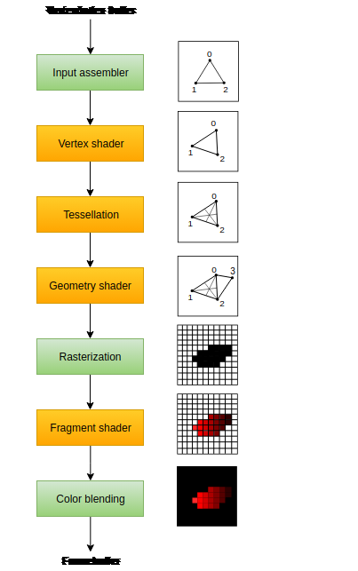

# Graphics Pipeline

Graphics pipelines are used for rendering operations, such as drawing triangles, applying textures, and rasterization. They consist of several stages, including:
Graphics pipelines are used for rendering operations, such as drawing triangles, applying textures, and rasterization. They consist of several stages, including:

-   **Input Assembly**: The graphics pipeline begins with the input stage, where data is fed into the system. This data may include 3D models, textures, lighting information, and other assets that are used to create the final image. This stage collects vertex data from buffers and assembles it into geometric primitives (e.g., points, lines, or triangles).

-   **Vertex Shader**: A programmable stage that processes vertex data, such as transforming vertex positions or computing vertex attributes like normals or texture coordinates.

-   **Tessellation Control and Evaluation Shaders (optional)**: These programmable stages refine and subdivide geometric primitives to create smoother surfaces or more detailed geometry.

-   **Geometry Shader (optional**): A programmable stage that processes entire geometric primitives and can generate new geometry, such as points, lines, or triangles.

-   **Rasterization**: A fixed-function stage that converts geometric primitives into fragments, which are potential pixels on the screen.

-   **Fragment Shader**: A programmable stage that processes fragments, including computing final pixel colors and other per-fragment operations.

-   **Depth and Stencil Testing**: Fixed-function stages that perform depth and stencil tests to determine if fragments should be discarded or written to the render targets.

-   **Color Blending**: A fixed-function stage that combines the output of the fragment shader with the existing data in the render targets, based on blending operations and factors.

**Stages with a green color** are known as _fixed-function_ stages. These stages allow you to tweak their operations using parameters, but the way they work is predefined.

**Stages with an orange color** on the other hand are `programmable`, which means that you can upload your own code to the graphics card to apply exactly the operations you want. This allows you to use fragment shaders, for example, to implement anything from texturing and lighting to ray tracers. These programs run on many GPU cores simultaneously to process many objects, like vertices and fragments in parallel.

