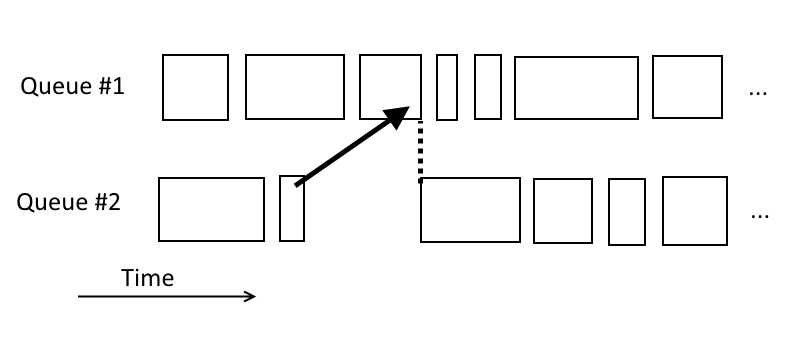
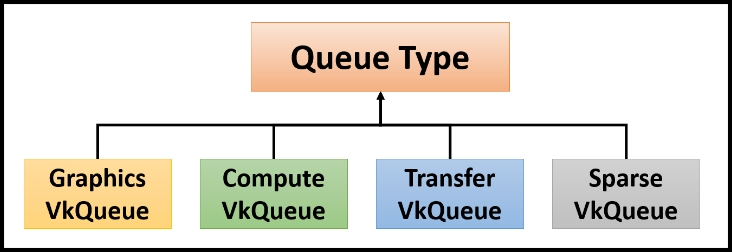
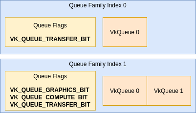
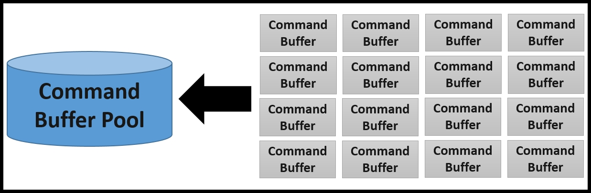
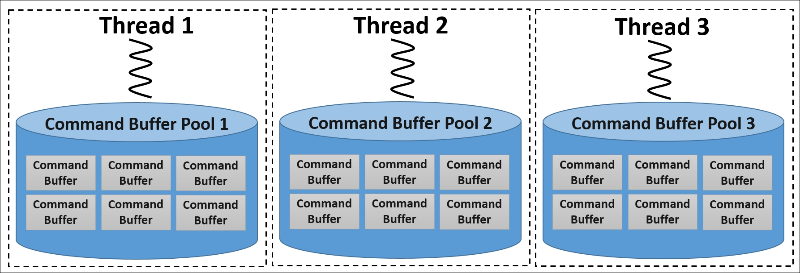
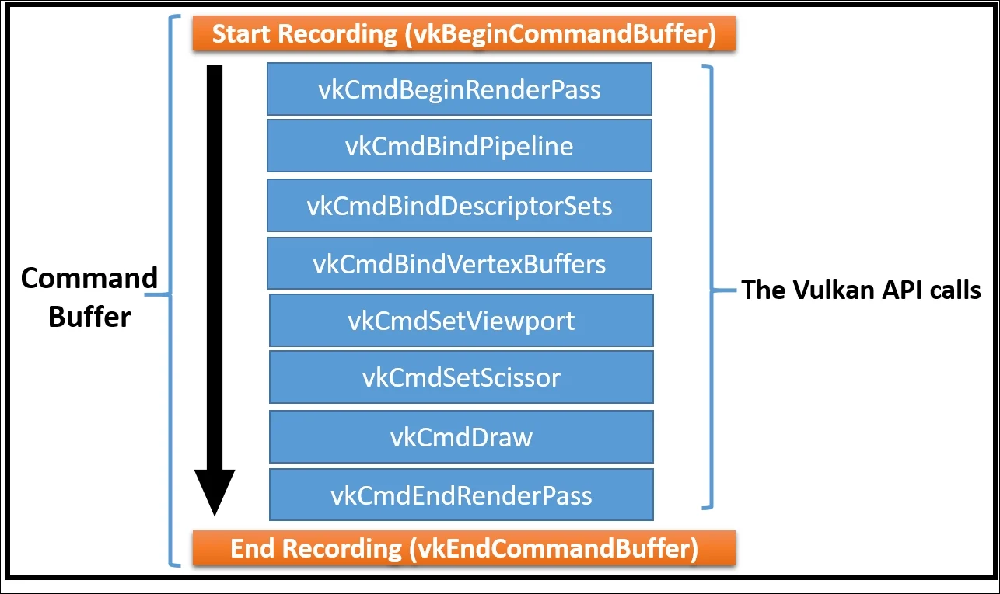

# Queus In Vulkan

In Vulkan, queues are the primary means of communication between the CPU and the GPU. They act as conduits for submitting commands to the GPU for execution. Queues are always associated with a specific device. 

Queues in Vulkan handle command execution asynchronously, allowing for efficient parallelism and resource utilization. However, operations submitted to different queues are processed independently (if we need, we can synchronize them):

Different queues may represent different parts of the hardware, and thus may support different kinds of operations. Not all operations may be performed on all queues. Queues with the same capabilities are grouped into families.

# Queue Families

Queues are grouped into one or more queue families, each containing one or more queues that has their specific capabilities and characteristics. Each queue family supports one or more types of operations, such as graphics, compute, or transfer tasks. The concept of queue families exists in graphics APIs like Vulkan and DirectX 12, which provide more control over the GPU's resources and enable better parallelism and performance.

The main types of operations supported by queue families are:

1.  **Graphics**: These queues are responsible for processing rendering commands, such as drawing triangles, applying textures, and rasterization. Graphics queues are essential for any application that involves visual rendering, like video games or 3D modeling software.

2.  **Compute**: Compute queues are designed to handle general-purpose computing tasks that can be offloaded to the GPU for faster processing. They can perform operations such as image processing, physics simulations, or machine learning computations. Compute queues enable GPU-based parallelism to accelerate these tasks.
   
3.  **Transfer**: Transfer queues are specialized for handling data transfers between the GPU and system memory or other resources. They are used to upload textures, vertex data, or other resources to the GPU or download the results of rendering or computing tasks from the GPU.

4.  **Sparse memory**: Sparse memory queues are used for managing sparse memory resources, which are memory allocations that don't have a continuous block of memory but rather are made up of multiple smaller, non-contiguous memory regions. This type of queue is useful for applications that deal with large, sparsely populated data sets, like virtual textures or streaming assets.

When you create a logical device in a graphics API like Vulkan or DirectX 12, you need to specify which queue families your application requires. Different GPUs may have different numbers of queues in each family, and some may even have multiple families with the same capabilities. By selecting the appropriate queue families and utilizing the available queues efficiently, you can achieve better parallelism and performance in your application.

Queues within a single family are essentially identical. Their capabilities are the same, their performance level and access to system resources is the same, and there is no cost (beyond synchronization) of transferring work between them.

# Command Buffers

As the name suggests, a command buffer is a buffer or collection of commands in a single unit. A command buffer records various Vulkan API commands that an application is expected to execute. Command buffers once baked can be reused again and again. They record the commands in the sequence that is specified by the application. These commands are meant for carrying out different type jobs; this includes binding vertex buffer, pipeline binding, recording Render Pass commands, setting viewport and scissor, specifying drawing commands,  controlling copy operations on image and buffer contents, and more.

The number of command buffers in an application can vary from a few hundred to thousands. The Vulkan API is designed to offer maximum performance; therefore, the command buffers are allocated from the command pools in order to minimize the cost of resource creation across multiple command buffers. A command buffer cannot be created directly; instead, it is allocated from the command pool.

Command buffers are persistent; they are created once and can be reused continuously. Further, if a command buffer is no longer useful, it can be renewed with a simple reset command and made ready for another recording. This is an efficient way as compared to destroying and then creating a new buffer for the same purpose.

### Explicit synchronization

When multiple command buffers are created in a multithreaded environment, then it's advisable to separate the synchronization domains by introducing separate command pools for each thread. This makes the cost of command buffer allocations efficient since the application does not need explicit synchronization in a different thread.

However, it is the application's responsibility to manage the synchronization between the command buffers that are shared across multiple threads.

In contrast, OpenGL is an implicit synchronization model. In OpenGL, a lot of things are done automatically, which comes at the cost of a lot of resource tracking, cache flushing, and dependency chain construction. All of this is done behind the curtains, which indeed is an overhead of the CPU. Vulkan is fairly simple in this context; the explicit synchronization guarantees that there is no hidden mechanism nor an element of surprise.

## Primary vs Secondary Command Buffers

There are two types of command buffers: primary and secondary command buffers:

-  **Primary command buffers**: These are directly submitted to a device queue for execution and are the owners of the secondary command buffers.

Primary command buffers are typically used to define high-level execution sequences, such as rendering a scene or performing a compute operation. When submitting a primary command buffer to a queue, you can use synchronization primitives, like semaphores and fences, to control the order of execution and manage dependencies between different command buffers.

-  **Secondary command buffers**: These are executed through primary command buffers and cannot be directly submitted to queues.

Secondary command buffers are mainly used for organizing and reusing common sequences of commands or for enabling parallel command recording.

### Examples

Here are a few examples to further illustrate the differences and use cases for primary and secondary command buffers in a Vulkan application

**Example 1: Rendering a scene with multiple objects:** 

Consider a 3D scene with multiple objects that need to be rendered. You can use secondary command buffers to record the rendering commands for each object, and then use a primary command buffer to execute the secondary command buffers in the desired order. This allows you to reuse the secondary command buffers for multiple frames or across different primary command buffers, reducing the overhead of recording commands for each object every frame.

-   Primary command buffer:
    -   Begin render pass
    -   Execute secondary command buffer (Object 1)
    -   Execute secondary command buffer (Object 2)
    -   Execute secondary command buffer (Object ...)
    -   End render pass
-   Secondary command buffer (Object 1):
    -   Bind pipeline
    -   Bind vertex buffer
    -   Bind descriptor set
    -   Draw object
-   Secondary command buffer (Object 2):
    -   Bind pipeline
    -   Bind vertex buffer
    -   Bind descriptor set
    -   Draw object

**Example 2: Multi-threaded command recording:**

In a multi-threaded application, you might want to record commands in parallel to improve performance. In this case, you can use secondary command buffers to record commands on multiple threads, and then use a primary command buffer to execute the secondary command buffers.

-   Thread 1:
    -   Record secondary command buffer (Task A)
-   Thread 2:
    -   Record secondary command buffer (Task B)
-   Main thread:
    -   Record primary command buffer:
        -   Execute secondary command buffer (Task A)
        -   Execute secondary command buffer (Task B)

## Recording Command Buffers

A command buffer is recorded using the `vkBeginCommandBuffer()` and `vkEndCommandBuffer()` APIs. These APIs define the scope under which any specified Vulkan commands are recorded. The following example shows the recording of the Render Pass instance creation between these two APIs, which works as the start and end scopes.

# Summary

To use a queue, you typically follow these steps:

1.  **Query the available queue families** on the target device to determine their capabilities and the number of queues they support.
   
2.  **Select the appropriate queue family** or families for your specific use case.
   
3.  **Request one or more queues** from the selected queue family or families when creating a logical device.
   
4.  **Record commands into command buffers**. Commands can include rendering, computing, or memory transfer operations, depending on the capabilities of the queue family.
   
5.  **Submit the command buffers** to the appropriate queue for execution.
