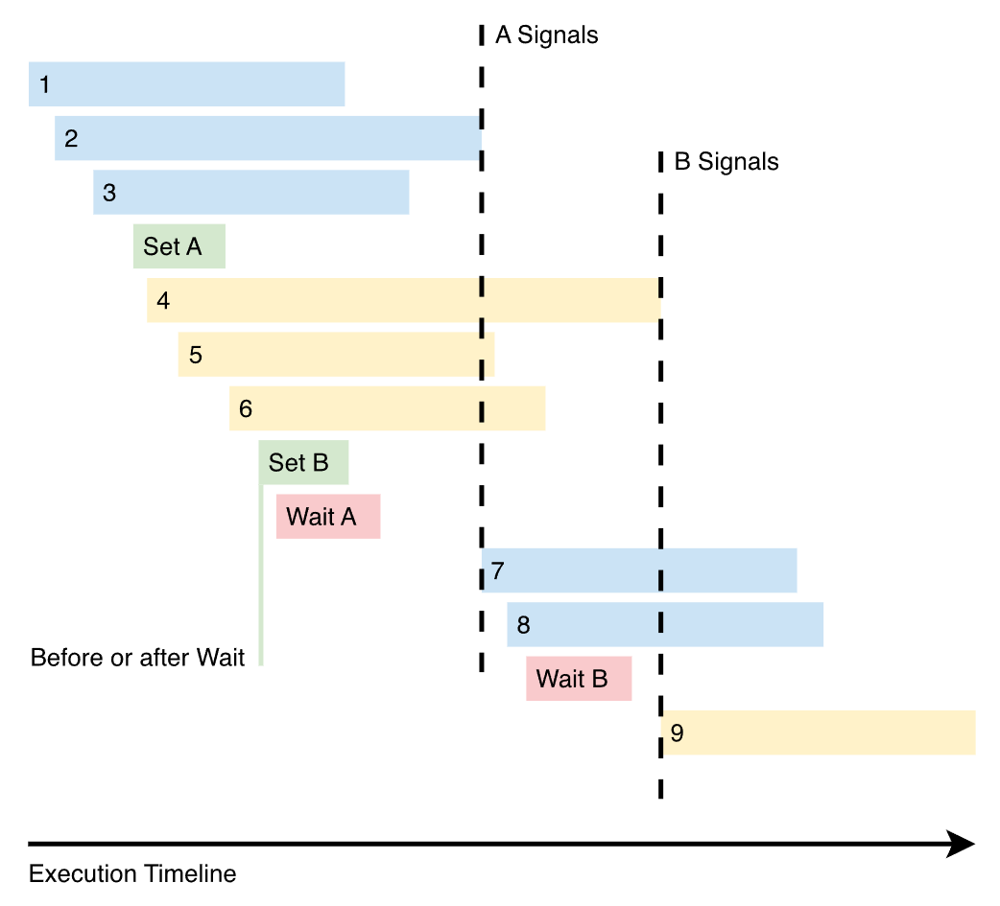

# Why is Synchronization Important?

Vulkan gives us increased control over the render process to maximize the use of both CPU and GPU resources by running many tasks in parallel. Whereas previous generation APIs were presented as if operations ran sequentially, Vulkan is explicitly parallel and built for multithreading.

For example, the GPU and CPU can run various fragment and vertex operations of the current frame and the next frame all independently of each other. By being specific about which operations need to wait on one another and which operations do not need to wait, Vulkan can render scenes with maximum efficiency and minimal wait time.

By putting CPU and GPU cores to work in tandem with the correct coordinated timing we can keep resources from idling for longer than they need to, squeezing the most performance out of the user’s system. The key is making sure that any parallel tasks wait only when they need to, and only for as long as necessary.

This is where proper and effective synchronization comes into play.

For example, we need to keep the final post-processing shader effect of a game waiting until the current frame has been fully rendered to avoid render artifacts or other strangeness. Vulkan’s synchronization operations let us define these tasks and dependencies as part of the render pipeline so that it can process the work as efficiently as possible.

To understand how this works, we need to look at synchronization at two levels: within a single queue and across multiple queues. Let’s start by looking at in-queue synchronization.

# Synchronization Within a Device Queue

Vulkan enables us to send command buffers into a queue to process graphics operations. This process is designed to be thread-friendly so we can submit work using command buffers from any CPU thread and they are eventually inserted into the same GPU queue. This gives us the ability to do our own multi-threading while Vulkan runs its commands, also often in parallel, computing vertices or loading textures to maximize the use of all CPU cores.

Note that our commands can depend on the completion of other commands even within the same queue, and they do not need to be in the same command buffer. Commands are also guaranteed to start in the exact order they were inserted, but because they can run in parallel, there is no guarantee that the commands will complete in that same order.

The in-queue tools for synchronization that ensure these commands wait correctly on their dependencies are pipeline barriers, events, and subpass dependencies. Let's take a look at how to use each one.

## Pipeline Barriers

Pipeline barriers specify what data or which stages of the rendering pipeline to wait for and which stages to block until other specified stages in previous commands are completed.

Keep in mind that these barriers are **GPU-only**, which means that we cannot check when a pipeline barrier has been executed from our application running on the CPU. If we need to signal back to the application on the CPU, it’s possible to do so by instead using another tool called a fence or an event, which we will discuss later.

The two types of barriers are:

-   Execution barriers
-   Memory barriers

### Execution Barriers

When we want to control the flow of commands and enforce the order of execution using pipeline barriers, we can insert a barrier between the Vulkan action commands and specify the prerequisite pipeline stages during which previous commands need to finish before continuing ahead. We can also specify the pipeline stages that should be on hold until after this barrier.

### Memory Barriers

To increase performance under the hood, Vulkan uses a series of caching mechanisms between the fast L1/L2 cache memory on the CPU and GPU cores and the relatively slow main RAM memory.

When one core writes to memory (to a render target, for example), the updates could still only exist in a cache and not be available or visible to another core ready to work with it. Memory barriers are the tools we can use to ensure that caches are flushed and our memory writes from commands executed before the barrier are available to the pending after-barrier commands. They are also the tool we can use to invalidate caches so that the latest data is visible to the cores that will execute after-barrier commands.

#### Example of memory barriers

One scenario where we might want to set up a pipeline barrier is when we write to a texture image buffer in a compute shader and then use it in a fragment shader. That setup might look like this example from the [Vulkan synchronization examples wiki](https://github.com/KhronosGroup/Vulkan-Docs/wiki/Synchronization-Examples):

## Events

Another tool for synchronization in Vulkan is the event, which can be quite useful when we need to specify and run parallel computation. Events are particularly useful when you need to create dependencies between commands in a single queue without involving external queues. In Vulkan, you can use a `VkEvent` object to create an event. 

The key difference between events and pipeline barriers is that event barriers occur in two parts. The first part is _setting_ an event using **vkCmdSetEvent**, and the second is _waiting_ for an event with **vkCmdWaitEvents**.

Events have two main states: signaled and unsignaled. Commands can either wait for an event to be signaled or set an event to a signaled state. This allows you to create dependencies between commands within a single command queue, ensuring that some commands wait for others to complete before they start executing.

Here's a brief overview of how to use events in Vulkan:

1.  Create a VkEvent object using the `vkCreateEvent` function.
2.  Record a command buffer with the commands you want to execute. To set an event to the signaled state after certain commands have executed, use the `vkCmdSetEvent` command. This command specifies the event to be signaled and a pipeline stage bitmask indicating at which stage the event should be signaled.
3.  To make other commands wait for the event to be signaled, use the `vkCmdWaitEvents` command. This command specifies the event to wait for, the source and destination pipeline stage masks, and any memory barriers required to ensure proper memory synchronization.
4.  Submit the command buffer to the command queue using `vkQueueSubmit`.
5.  To reset the event back to the unsignaled state, use the `vkResetEvent` function.

#### Event Example

Let's illustrate an example of how events work:




```c++
// Three dispatches that don’t have conflicting resource accesses  
vkCmdDispatch( 1 );  
vkCmdDispatch( 2 );  
vkCmdDispatch( 3 );  
vkCmdSetEvent( A, srcStageMask = COMPUTE ); 

// 4, 5, and 6 don’t share resources with 1, 2, and 3  
// No reason for them to be blocked, so set an event to wait for later  
vkCmdDispatch( 4 );  
vkCmdDispatch( 5 );  
vkCmdDispatch( 6 );  
vkCmdSetEvent( B, srcStageMask = COMPUTE );  

// 7 and 8 don’t use the same resources as 4, 5, and 6.  
// 7 and 8 need the results of 1, 2, and 3  
// So we’ll wait for them by waiting on A  
vkCmdWaitEvents( A, dstStageMask = COMPUTE );  
vkCmdDispatch( 7 );  
vkCmdDispatch( 8 );  

// 9 uses the same resources as 4, 5, and 6 so we wait.  
// Also assumed is that 9 needs nothing from 7 and 8  
vkCmdWaitEvents( B, dstStageMask = COMPUTE );  
vkCmdDispatch( 9 );
```

# Synchronization Across Multiple Device Queues

Fences and semaphores are synchronization primitives used to manage and coordinate the execution of tasks or operations, particularly in multi-threaded or parallel processing environments. In the context of Vulkan, these synchronization mechanisms are crucial for managing the execution of commands on the graphics and compute pipelines, ensuring that tasks are completed in the correct order and avoiding data hazards.

## Fences

Fences: A fence is a synchronization primitive used to signal the completion of a set of operations submitted to a command queue. Fences can be used to wait for the completion of commands submitted to a queue, making them useful for coordinating operations between the CPU and the GPU. In Vulkan, you can use a VkFence object to create a fence.

To use a fence in Vulkan, you create and associate it with a command buffer submission, and then you can query or wait for its status from the CPU side. Fences are primarily used for **CPU-GPU synchronization**, where the CPU can wait for the GPU to complete a set of tasks before moving forward.

## Semaphores

Semaphores: A semaphore is another type of synchronization primitive used to signal and wait for the completion of operations between different command queues or within a single command queue. Semaphores are often used for **GPU-GPU synchronization**, where one set of operations needs to be completed before another set can begin. In Vulkan, you can use a VkSemaphore object to create a semaphore.

To use a semaphore in Vulkan, you specify it as a signal or wait semaphore when submitting command buffers to the queue. When a command buffer associated with a signal semaphore reaches the end of its execution, the semaphore is signaled. A command buffer associated with a wait semaphore will only begin executing once the associated semaphore has been signaled.

## Timeline Semaphores

A timeline semaphore, unlike a binary semaphore, uses a 64-bit integer (called the "timeline value") to represent its state. When a timeline semaphore is signaled, it advances its timeline value to a higher number, and when it is waited upon, it compares the wait value to the current timeline value. If the timeline value is greater than or equal to the wait value, the wait operation is considered complete, and the next operation can proceed.

Here's a simplified timeline of how timeline semaphores work:

1. **Initialization**: A timeline semaphore is created with an initial timeline value.
2. **Signal operation**: The producer of a GPU workload signals the semaphore, indicating that the work is complete. The timeline value is advanced to a higher number, representing the completion of the work.
3. **Wait operation**: The consumer of the GPU workload waits on the semaphore with a specific wait value. If the current timeline value is greater than or equal to the wait value, the wait operation is considered complete, and the consumer can proceed with its work.
4. **Repeat**: Steps 2 and 3 can be repeated for subsequent GPU workloads, with the timeline value increasing over time to represent the completion of more work.

Timeline semaphores offer several advantages over traditional binary semaphores:

- **Flexibility**: Timeline semaphores can be used to synchronize multiple stages of a pipeline, as well as different pipelines, with a single synchronization object.

- **Granularity**: Timeline semaphores provide finer-grained synchronization, allowing for more efficient scheduling and better parallelism between different stages of a pipeline.

- **Debugging**: The timeline values can be used to track the progress of workloads and detect potential deadlocks or performance bottlenecks.